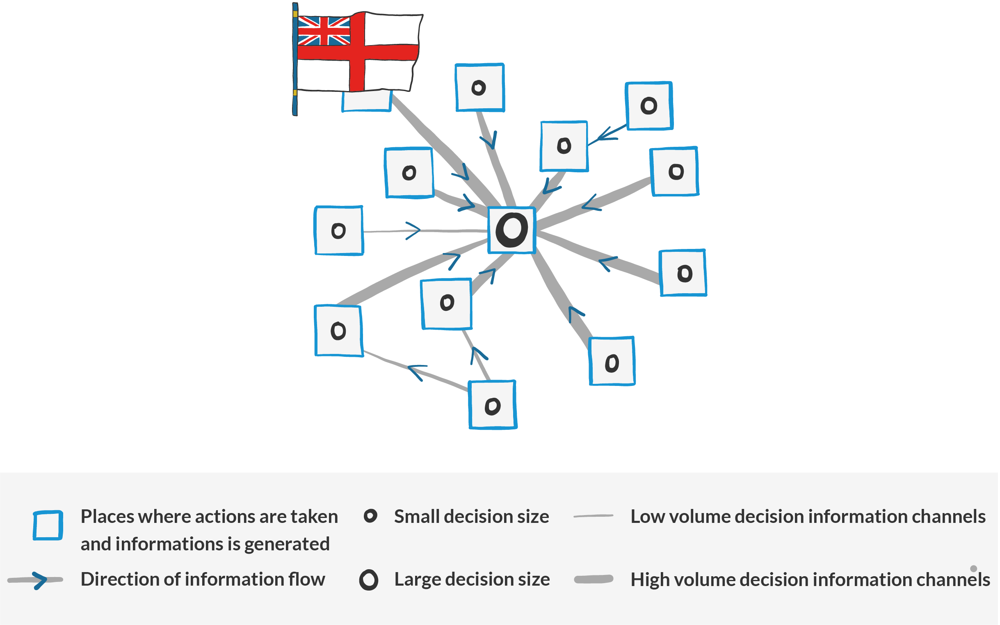
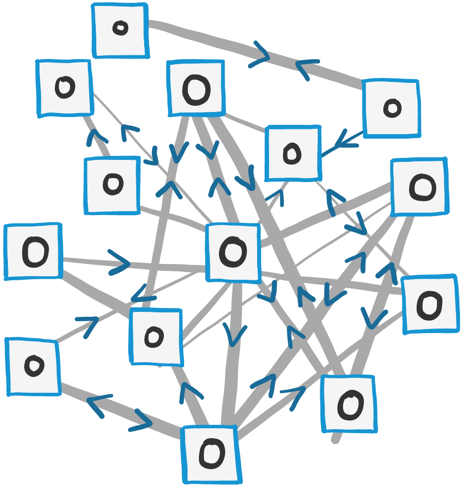
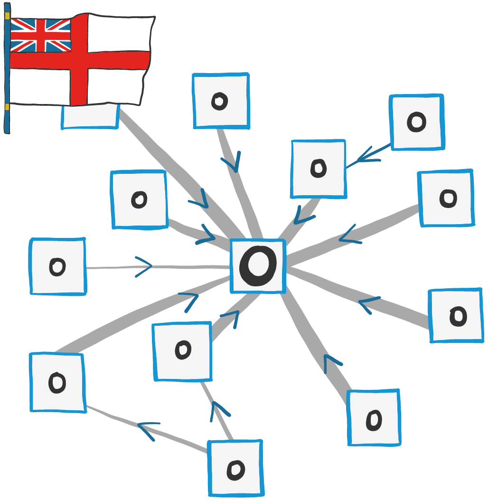
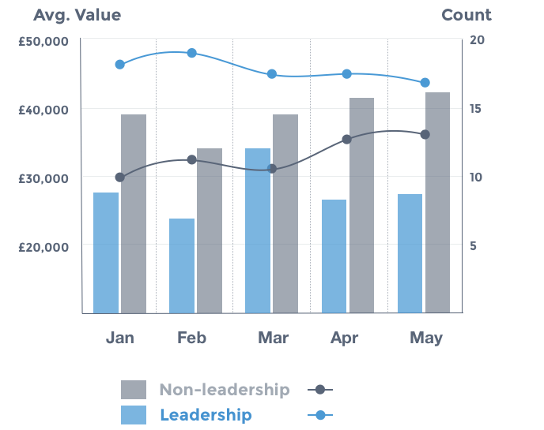

# Background

## Benefits of the Advice Process

_“The more decisions I made, the less engaged others become, and the less ownership they had in the results”_

_-_ [_Dennis_](https://www.slideshare.net/pearpress/the-decisionmaker-dennisbakkeppt) [_Bakke_](https://www.slideshare.net/pearpress/the-decisionmaker-dennisbakkeppt)

All this AP business would seem a lot of effort, if there weren’t significant benefits to putting such a process in place. Thankfully, there are. Here’s a rundown.

**Collaboration**

* Everyone becomes more engaged: people feel more ownership when their advice is sought. Even if their advice isn't followed, at least they feel heard and part of the process.
* When decisions involve more people who are fully engaged, an organisation has a higher chance of a good outcome than it does with a conventional top-down approach, thanks to greater levels of buy-in.

**Accountability**

* When decisions are made by the people who are closest to the problem, they understand the context. Another factor in increasing the likelihood of success of an initiative.
* With full accountability comes ownership; people are more inclined to work towards the success of the project, as if it were their own.

**Transparency**

* Transparency ensures the process is self-policing – if you’re worried about what other people might think about your decision, then perhaps it's not such a great decision \(or demands further consideration\).
* It’s harder to not give the advice process its proper attention when others are looking in.
* Transparency is a prerequisite to ensure we don’t descend into chaos. Where decisions have wide impact, a visible decision-making process helps those impacted to understand what/how/why something is happening.
* Transparency aligns decision making in terms of consistency, in the absence of a central decision-making authority.
* Transparency helps people learn how to make better decisions \(especially if we come back to decisions retrospectively to record the results\). This is the point of the advice process, to help people become better decision makers on management-like decisions.
* Transparency provides a wider organisational context, helping to reduce waste and providing the platform to make better decisions.

**Feedback and Learning**

* Decisions that are made by people who are closest to the action receive faster feedback on the outcome, therefore providing a faster learning loop.
* The AP provides ongoing on-the-job education – no training can match real-world experience.

## The Process in a Picture

## When to use the Advice Process

**Using the Advice Process is all about managing change. So if you’re trying to change something in the organisation, you should consider using the AP.**

If you’re **making a decision that someone else should know about**, consider using the Advice Process.

If you are **trying something for the first time**, consider using the Advice Process. The AP helps us learn, both as individuals and as an organisation. If you want to do something that you’ve not seen done before at EE, or is not considered business-as-usual within the company, consider using the AP. It might seem like a very familiar decision for you, but it’s not just about you; it’s about helping the rest of EE learn.

The AP improves communication and transparency, and clarifies accountability. Ultimately we’d like to see the AP become _**our preferred form of communicating any decisions**_.

The Advice Process should add value, not bureaucracy. If you’re making a decision and don’t see any way the AP will create value – from anyone’s perspective – then don’t use it. If you’re not sure, ask. If you’re still not sure, try. The downside is low, the upside high.

So let’s experiment!

## The principles to get behind

There are some key principles and assumptions that underpin the Advice Process – and they run counter to traditional corporate models. It’s important that you \(and your colleagues!\) buy into these if the Advice Process is to succeed.

You need to believe that people are:

* Grown-ups and want to be treated as such.
* Care about doing the right thing for the company.
* Capable of providing insights and perspectives.
* Capable of making decisions.
* Unique and creative thinkers.
* Capable of learning, and up for a challenge.

Let’s be honest – in some organisations, these concepts would be difficult to embed. However, we’re fortunate at Equal Experts in that we’ve long encouraged this kind of thinking; our co-founder Thomas de Cad’oro Granier has long expressed a desire for EE to be a ‘company of grown-ups’, an attitude that naturally dovetails with the kind of thinking above.

Whilst many large companies will talk about similar principles, the proof is in how they are executed. They need to be the reality if the AP is to work.

**Pro tips:**

* People aren’t perfect – we are all fallible, no matter where we fall in the hierarchy or how long we’ve been within the organisation.
* It’s hard to let go as a boss and trust and empower people. Do not underestimate how easy it is to slip back into the old ways

## Adoption pains

Adopting a management system like the Advice Process doesn’t happen overnight. Even within EE, where we have intelligent, free-thinking people, there were many bumps in the road. The main problems we encountered were around the transition of power, permission seeking and dealing with the tyranny of structurelessness.

### Dealing with Uncertainty

A side effect of the Advice Process is that power and control is distributed widely throughout the company. This transition can be particularly difficult for those used to making decisions on behalf of others. Passing decision-making onto others brings uncertainty and feelings of lack of control, which may be uncomfortable for some. Over time, most people adjust to this new way of working, but if it completely goes against your grain, EE may not be the right fit for you.

### Permission Seeking

The counter side to managers letting go is team members defaulting to the reflex of permission seeking. If you are the one who is being asked “for permission” then try not to just make a call but rather use this as a teachable opportunity. Ask questions about the problem, who are experts in the area, who might be affected and help them think about measuring the outcomes and reflecting on the learning. Basically, give them the tools and help them understand how to use them.

### Drawing the Line

Another regular bump in the road we encounter is drawing the line between decisions that are small, fast or low-risk enough to incorporate in our everyday work versus those that benefit from the investment, transparency and consultation of using the Advice Process. The same conflict occurs when faced with decisions that are larger, but fall within one’s existing responsibilities. Using the Advice Process doesn’t come for free, so the benefits its usage brings need to be weighed up against the cost. Often we’ll apply the principles of the Advice Process \(e.g. soliciting advice, enumerating the costs and success metrics\), without formally writing up and publishing the decision. This is a blurred line that we still haven’t got totally right and can generate some confusion; something we continue to work on.

## The Advice Process protocol

It’s important to understand where the Advice Process fits into different decision-making frameworks. Because we talk about flat organisations and distributed decision-making, people often make misplaced assumptions about the AP; hopefully this section will help to frame where it sits in the overall picture.

### Different protocols for making decisions

The Advice Process is not about gaining consensus, consent or winning a popular vote to proceed with a given action. But it also differs from the traditional, top-down, ‘_I have a mandate_’ model that exists in most organisations today.

The messy reality of life is that people have things they prefer \(“I want apples”\), things they will tolerate \(“I could have any fruit”\) and things they object to \(“I won’t eat junk food”.\) On a basic level, this can be applied to the different decision-making protocols to highlight how each approach is impacted by group dynamics, as shown below.

| **Only me** | **Me and someone else** | **The messy real world...** |
| :--- | :--- | :--- |
|  |  |  |

From: [London - Decentralised Decision Making - April 2019](https://docs.google.com/presentation/d/1coels2ur22VV9Hpmy02WTlYY-QIJ5rayWtv75hQYb8E/edit?usp=sharing)

### Outline of the Different Protocols

| **Decision protocol** | **How the decision is made** |
| :--- | :--- |
| Consensus | Seeks as much agreement as possible, so there is a general agreement around the proposal. Impact: your proposal moves to match that of the group despite your preference. |
|  |  |
| Consent | Seeks to remove objections or gain ‘permission’ on the proposal; “I’ll proceed if no one objects.” Impact: If you can’t remove objections to your proposal, then it fails to proceed. |
|  |  |
| Democratic | Seeks to bring a proposal to the point where a simple majority prefer or tolerate it. Impact: Your proposal moves to where you think you can gain sufficient support to proceed. |
|  |  |
| **Advice \(Process\)** | **Seeks input, which influences the decision maker’s preference. Decision then made based on that preference. Impact: Your decision aligns with what you think is the** _**best course of action for the proposal, given the advice you’ve received.**_ |
|  |  |
| Mandate | Decision made within the boundaries of decision maker’s role. “I’ll proceed if I prefer.” Impact: The proposal aligns with the decision maker’s preference, but often without testing the proposal. |
|  |  |

### Different Characteristics of the Different Protocols

In the ‘Benefits of the Advice Process’ section above, we identified four key aspects EE is looking for when making decisions. **Collaboration**, **Accountability**, **Transparency** and an opportunity for **Feedback and Learning.** Here’s how each of the protocols stacks up against those requirements – it’s fairly obvious why we chose the Advice Process.

|  | **Collaboration** | **Accountability** | **Transparency** | **Feedback & Learning** |
| :--- | :--- | :--- | :--- | :--- |
| **Consensus** | YES | NO | YES | ? |
| **Consent** | YES | NO | YES | ? |
| **Democratic** | YES | NO | YES | ? |
| **Advice \(Process\)** | YES | YES | YES | YES |
| **Mandate** | NO | YES | NO | ? |

### 

#### Advice vs. Consensus, Consent & Democratic Protocols

As outlined in the table, the core difference between the Advice Process and Consensus, Consent & Democratic Protocols is the focus on **Accountability**. This is important, because when looking to drive an initiative though what are essentially voting systems, you end up getting the worst of all worlds:

* The initiative that the person is driving ceases to be their own, and turns into a watered-down set of compromises that no one can love or get passionate about.
* In the event of running the initiative, it becomes easy to shirk responsibility because the ideas are not fully the owners.

In contrast, with the Advice Process:

* The Decision Maker is clearly accountable for the outcome. They are under no obligation to implement the advice given \(only to listen with an open mind\), so it’s very clear where accountability and responsibility lie.
* People are motivated when they feel they have ownership of what’s happening. That ownership just doesn’t exist in the same way with a vote.
* People work hard to make the right decision when they are clearly accountable.

_“In the Advice Process when someone only gets to give advice, they know someone heard what they had to say. They made their case. They had a conversation. They didn’t just cast a ballot.”_[_\[1\]_]()

#### 

#### Advice vs. Mandate

Like the Advice Process, accountability is clear when using a Mandate protocol. However, it cannot offer anywhere near the same level of **collaboration** or **transparency**. With collaboration – including advice from experts and those motivated to contribute due to the impact on them – the quality of decision making will only increase. And with transparency, the decision-maker will be motivated to make the best decision possible, and be prepared to own it. For us at Equal Experts, it’s just not acceptable to do away with either of these aspects.

## Pirate or navy? The empowerment of teams and the decentralisation of decision making

Generally, teams perform better when they’re able to apply their collective brainpower to problems and are given the autonomy to take action, rather than having solutions dictated to them.

However, there are times when this model falls apart; teams given this freedom can end up spinning around in circles, wasting time and effort performing unnecessary tasks. Too often the organisation’s central command-and-control impulse then kicks in, the autonomy is removed and the initiative is written off as some crazy agile experiment that was doomed to fail from the beginning.

A key reason behind our adoption of the Advice Process is that it brings additional benefits around decentralisation and provides genuine empowerment to make decisions.

Usually, when people talk about decentralisation and empowerment, they mean delegating decisions to a lower level in a hierarchy; however this is only part of the picture. We can illustrate what we mean with the metaphor of a navy vs. pirates \(arrr!\).

A simplified decentralisation model would look at who makes the most important decisions \(and who can overrule the decisions made by others\).

With this model you can clearly see where pirates are in relation to the navy, and in recent years IT practices have tended towards being more pirate, with agile teams allowing for quicker decision making. However, when we look back in history, the navy ends up winning. It could co-ordinate ships and assets more effectively, Blackbeard was vanquished and the golden age of pirates came to an end. So does that mean that highly centralised always beats highly decentralised?

**A new model**

The big advantage that the navy has over the pirate is being able to create and own the big-picture view that enables them to make better strategic decisions. Information is generated in nodes, then flows into the central command, thus allowing a strategic picture to be created. Decisions made locally are small and can be overridden by central command, but that’s the trade-off for running top-down strategy.

Compare this to the pirate model, where bigger decisions are made in the places where the information is generated. This creates the ability to respond in a highly agile way, but building up the big picture is hard because the information doesn’t flow around the network and no single node has the necessary context to create a strategy.

To create the best of both worlds you need to become more like the SBS \(or for our American cousins the Navy Seals\) - highly-connected but autonomous special forces of the sea. In this way, agility is maintained as decisions are made where the action is. However, the local nodes share information and are highly connected, and by giving them access to the big-picture context it allows them to make high-quality strategic decisions.

#### Centralised v decentralised

<table>
  <thead>
    <tr>
      <th style="text-align:left"><b>Independent, decentralised decision makers (Pirate)</b>
      </th>
      <th style="text-align:left"><b>Independent, decentralised decision makers, with highly connected decision information</b>
      </th>
      <th style="text-align:left"><b>Centralised decision maker (Navy)</b>
      </th>
    </tr>
  </thead>
  <tbody>
    <tr>
      <td style="text-align:left">
        
      </td>
      <td style="text-align:left">
        
      </td>
      <td style="text-align:left">
        
      </td>
    </tr>
    <tr>
      <td style="text-align:left">
        <ul>
          <li>Highly agile</li>
          <li>Decisions made directly by those on the ground</li>
        </ul>
      </td>
      <td style="text-align:left">
        <ul>
          <li>Highly agile</li>
          <li>Decisions made directly by those on the ground</li>
          <li>Information network feed to the decision makers</li>
          <li>Decision makers have big picture awareness and context</li>
        </ul>
      </td>
      <td style="text-align:left">
        <ul>
          <li>Information network feed to the decision makers</li>
          <li>Decision makers have big picture awareness and context</li>
        </ul>
      </td>
    </tr>
    <tr>
      <td style="text-align:left">
        <ul>
          <li>Decision makers lack big picture awareness</li>
          <li>Limited channels of information between decision makers</li>
        </ul>
      </td>
      <td style="text-align:left">
        <ul>
          <li>HIgh effort communications channels between decision makers</li>
        </ul>
      </td>
      <td style="text-align:left">
        <ul>
          <li>Limited agility &amp; pace of local response</li>
          <li>Decisions made by indirect decision makers (those without local awareness)</li>
        </ul>
      </td>
    </tr>
  </tbody>
</table>**How to navigate the high seas**

The first key take-away: to truly benefit from a decentralised decision-making process, decision makers must have access to information that allows them to make a high-quality decision. This is more than the local, situational awareness that comes with ‘being on the ground’ but does include the decentralised teams knowing the wider strategic context.

If they don’t want to go the way of the golden age pirates, those further up in the hierarchy must ensure high-quality information flows freely around the network, and access to experts, hierarchy and organisational information must not be restricted as it’s key to maintaining a decentralised model. This flow of information must come from all directions - it’s not only the responsibility of “The Management”. Teams also have an obligation to share information about their local context with the wider organisation.

**Trust those on deck**

Once a high-quality information flow is in place, a second key take-way is that those further up the hierarchy must trust the local decision makers to use this information to make the right decision. Even if decision-makers are given all the information they could possibly need, it won’t make a difference if central command doesn’t trust them to make decisions on behalf of the organisation. If trust isn’t there, the decentralised model will revert to command and control.

Maintaining information flow across the organisation takes time and effort - it’s not something that just happens. If you want individuals or teams to operate autonomously then they must know what’s going on. Context takes time to build, and involves information that initially might not seem relevant only to become so at a later date. Right from the top, try to operate as much as possible in the open, share your high level strategy and embed it into cultural fabric. Let people know the bad news as well as the good, start sharing stories and use tools that invite the free flow of information. Expecting teams to be autonomous and strategic is possible, but only with this added effort.

Revolutions fail because those that come into power afterwards are the ones that are best organised and control communication, \(often the same group that was recently overthrown!\) So to keep the revolution going, encourage your teams to share local context and give them the right strategic information. If you then trust them to act in your best interests, autonomous teams have a real chance of succeeding.

**Pro tips: measuring decentralisation and empowerment of decision making.**

At Equal Experts we hold a log of all APs published. This allows us to answer the following questions:

* In the past month, what percentage of the employed base have published an AP?
* In the past month, what is the total value / average value / count of AP for Leadership / Non-leadership roles?
* In the past 12 months how many AP decisions have been overturned by “Leadership”?

<table>
  <thead>
    <tr>
      <th style="text-align:left">
        
      </th>
      <th style="text-align:left">
        
If distribution of decisions is desired then:

        <ul>
          <li>APs created by non-leadership roles should have an &#x201C;average value&#x201D;
            that is tending towards that of leadership roles.</li>
          <li>Volume of APs created should bias towards non-leadership roles over time.</li>
        </ul>
      </th>
    </tr>
  </thead>
  <tbody></tbody>
</table>How the AP works
