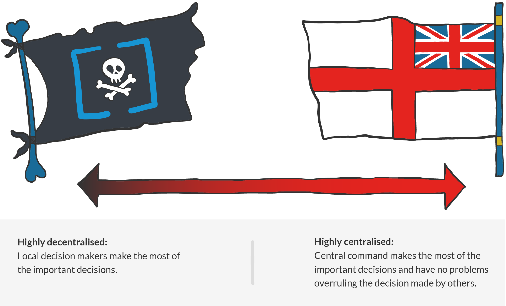
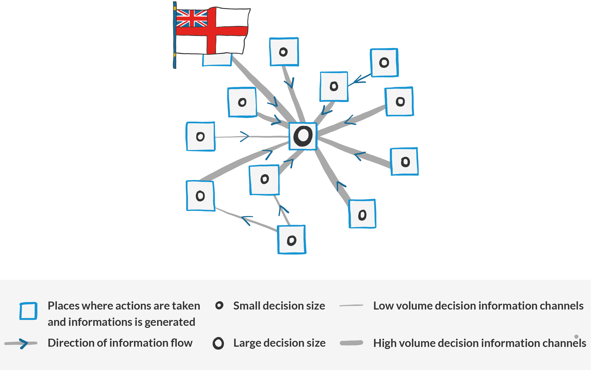
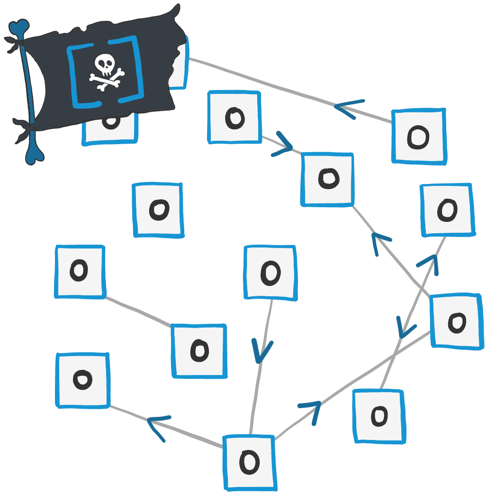
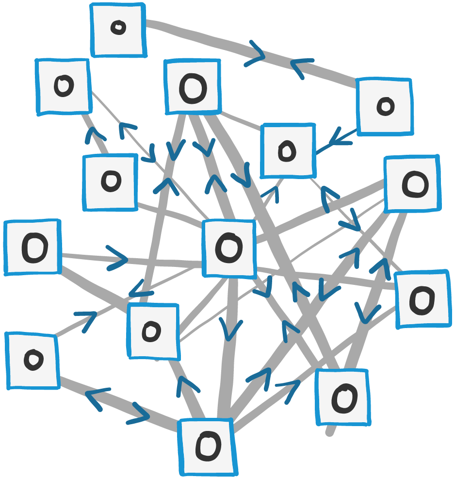
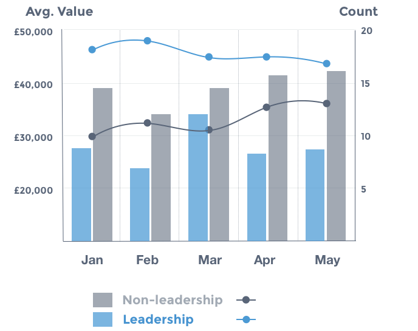

# Pirate or navy?

Generally, teams perform better when they’re able to apply their collective brainpower to problems and are given the autonomy to take action, rather than having solutions dictated to them.

However, there are times when this model falls apart; teams given this freedom can end up spinning around in circles, wasting time and effort performing unnecessary tasks. Too often the organisation’s central command-and-control impulse then kicks in, the autonomy is removed and the initiative is written off as some crazy agile experiment that was doomed to fail from the beginning.

A key reason behind our adoption of the Advice Process is that it brings additional benefits around decentralisation and provides genuine empowerment to make decisions.

Usually, when people talk about decentralisation and empowerment, they mean delegating decisions to a lower level in a hierarchy; however this is only part of the picture. We can illustrate what we mean with the metaphor of a navy vs. pirates \(arrr!\).

A simplified decentralisation model would look at who makes the most important decisions \(and who can overrule the decisions made by others\).

With this model you can clearly see where pirates are in relation to the navy, and in recent years IT practices have tended towards being more pirate, with agile teams allowing for quicker decision making. However, when we look back in history, the navy ends up winning. It could co-ordinate ships and assets more effectively, Blackbeard was vanquished and the golden age of pirates came to an end. So does that mean that highly centralised always beats highly decentralised?

### **A new model**

The big advantage that the navy has over the pirate is being able to create and own the big-picture view that enables them to make better strategic decisions. Information is generated in nodes, then flows into the central command, thus allowing a strategic picture to be created. Decisions made locally are small and can be overridden by central command, but that’s the trade-off for running top-down strategy.

Compare this to the pirate model, where bigger decisions are made in the places where the information is generated. This creates the ability to respond in a highly agile way, but building up the big picture is hard because the information doesn’t flow around the network and no single node has the necessary context to create a strategy.

To create the best of both worlds you need to become more like the SBS \(or for our American cousins the Navy Seals\) - highly-connected but autonomous special forces of the sea. In this way, agility is maintained as decisions are made where the action is. However, the local nodes share information and are highly connected, and by giving them access to the big-picture context it allows them to make high-quality strategic decisions.

### Centralised v decentralised

| **Independent, decentralised decision makers \(Pirate\)** | **Independent, decentralised decision makers, with highly connected decision information** | **Centralised decision maker \(Navy\)** |
| :--- | :--- | :--- |

|  |  |  |
| :--- | :--- | :--- |

<table>
  <thead>
    <tr>
      <th style="text-align:left">
        <ul>
          <li>Highly agile</li>
          <li>Decisions made directly by those on the ground</li>
        </ul>
      </th>
      <th style="text-align:left">
        <ul>
          <li>Highly agile</li>
          <li>Decisions made directly by those on the ground</li>
          <li>Information network feed to the decision makers</li>
          <li>Decision makers have big picture awareness and context</li>
        </ul>
      </th>
      <th style="text-align:left">
        <ul>
          <li>Information network feed to the decision makers</li>
          <li>Decision makers have big picture awareness and context</li>
        </ul>
      </th>
    </tr>
  </thead>
  <tbody></tbody>
</table>

<table>
  <thead>
    <tr>
      <th style="text-align:left">
        <ul>
          <li>Decision makers lack big picture awareness</li>
          <li>Limited channels of information between decision makers</li>
        </ul>
      </th>
      <th style="text-align:left">
        <ul>
          <li>HIgh effort communications channels between decision makers</li>
        </ul>
      </th>
      <th style="text-align:left">
        <ul>
          <li>Limited agility &amp; pace of local response</li>
          <li>Decisions made by indirect decision makers (those without local awareness)</li>
        </ul>
      </th>
    </tr>
  </thead>
  <tbody></tbody>
</table>

The first key take-away: to truly benefit from a decentralised decision-making process, decision makers must have access to information that allows them to make a high-quality decision. This is more than the local, situational awareness that comes with ‘being on the ground’ but does include the decentralised teams knowing the wider strategic context.

If they don’t want to go the way of the golden age pirates, those further up in the hierarchy must ensure high-quality information flows freely around the network, and access to experts, hierarchy and organisational information must not be restricted as it’s key to maintaining a decentralised model. This flow of information must come from all directions - it’s not only the responsibility of “The Management”. Teams also have an obligation to share information about their local context with the wider organisation.

### **Trust those on deck**

Once a high-quality information flow is in place, a second key take-way is that those further up the hierarchy must trust the local decision makers to use this information to make the right decision. Even if decision-makers are given all the information they could possibly need, it won’t make a difference if central command doesn’t trust them to make decisions on behalf of the organisation. If trust isn’t there, the decentralised model will revert to command and control.

Maintaining information flow across the organisation takes time and effort - it’s not something that just happens. If you want individuals or teams to operate autonomously then they must know what’s going on. Context takes time to build, and involves information that initially might not seem relevant only to become so at a later date. Right from the top, try to operate as much as possible in the open, share your high level strategy and embed it into cultural fabric. Let people know the bad news as well as the good, start sharing stories and use tools that invite the free flow of information. Expecting teams to be autonomous and strategic is possible, but only with this added effort.

Revolutions fail because those that come into power afterwards are the ones that are best organised and control communication, \(often the same group that was recently overthrown!\) So to keep the revolution going, encourage your teams to share local context and give them the right strategic information. If you then trust them to act in your best interests, autonomous teams have a real chance of succeeding.

### **Pro tips: measuring decentralisation and empowerment of decision making.**

At Equal Experts we hold a log of all APs published. This allows us to answer the following questions:

* In the past month, what percentage of the employed base have published an AP?
* In the past month, what is the total value / average value / count of AP for Leadership / Non-leadership roles?
* In the past 12 months how many AP decisions have been overturned by “Leadership”?

<table>
  <thead>
    <tr>
      <th style="text-align:left">
        
      </th>
      <th style="text-align:left">
        
If distribution of decisions is desired then:

        <ul>
          <li>APs created by non-leadership roles should have an &#x201C;average value&#x201D;
            that is tending towards that of leadership roles.</li>
          <li>Volume of APs created should bias towards non-leadership roles over time.</li>
        </ul>
      </th>
    </tr>
  </thead>
  <tbody></tbody>
</table>

