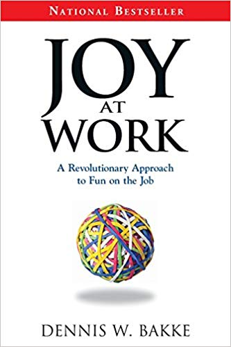
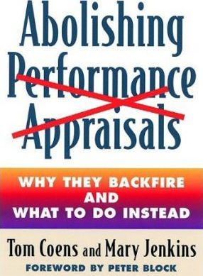

# Even more AP

## Interesting and Related Reading

<table>
  <thead>
    <tr>
      <th style="text-align:left">
        
<a href="http://decisionmakerbook.com"><b>The Decision Maker - Dennis Bakke</b></a>
        

        
Written in the same style as &#x2018;The Phoenix Project&#x2019; (or &#x2018;The
          Goal&#x2019; for the more discerning reader) this is a serious business
          book written as fiction to help explain the benefits for the Advice Process.
          If you like this style of writing then it&apos;s a great way to get to
          grips with the benefits and pitfalls of the advice process.

      </th>
      <th style="text-align:left">
        
      </th>
    </tr>
  </thead>
  <tbody>
    <tr>
      <td style="text-align:left">
        
<a href="http://www.dennisbakke.com"><b>Joy at Work - Dennis Bakke</b></a>
        

        
Also written by Dennis Bakke, this is a summary of the author&#x2019;s
          time at AEG and how he introduced the &#x2018;Decision Maker&#x2019; systems
          in his company. This is the genesis for the Advice Process framework, and
          a must-read if you want to implement something like it into your own organisation.

      </td>
      <td style="text-align:left">
        
      </td>
    </tr>
    <tr>
      <td style="text-align:left">
        
<a href="https://www.reinventingorganizations.com">Reinventing Organizations -</a> 
          <a
          href="https://www.reinventingorganizations.com">Frederic Laloux</a>
        

        
A summary book that captures experiences from a number of organisations
          that follow the self management guides. It was based on surveys of organisations,
          but focuses on a small number of companies that have been successful in
          this style of management.

      </td>
      <td style="text-align:left">
        
      </td>
    </tr>
    <tr>
      <td style="text-align:left">
        
<a href="https://www.goodreads.com/book/show/855795.Abolishing%5C_Performance%5C_Appraisals?from%5C_search=true">Abolishing Performance Appraisals: Why They Backfire and What to Do Instead</a>
        

        
This is the first book to offer specific suggestions on how to replace
          performance appraisals with a more effective system that emphasizes teamwork
          and empowerment. Feedback, compensation, coaching, promotion, and legal
          documentation are all covered, as well as a variety of new alternatives
          that produce better results for both managers and employees.

      </td>
      <td style="text-align:left">
        
      </td>
    </tr>
    <tr>
      <td style="text-align:left">
        
<a href="https://www.goodreads.com/book/show/22529127-team-of-teams">Team of Teams: New Rules of Engagement for a Complex World: General Stanley McChrystal</a>
        

        
Well worth a read. Covers open organisations and organisation design at
          scale, whilst changing structure from very closed to very open systems.
          Given that the context is the US intelligence services, the cultural challenges
          and resulting changes reported here are quite remarkable.

      </td>
      <td style="text-align:left">
        
      </td>
    </tr>
    <tr>
      <td style="text-align:left">
        
<a href="https://www.equalexperts.com/blog/ee-life/the-decision-is-mine/">The Decision is ... mine!</a>
        

        
A blog post created by one of Equal Experts own where Paul Keelan describes
          his own experience of using the Advice Process for the first time.

      </td>
      <td style="text-align:left">
        

        

          
        

      </td>
    </tr>
    <tr>
      <td style="text-align:left">
        
<a href="https://www.equalexperts.com/blog/ee-life/paving-the-way-to-a-more-open-sharing-network/">Paving the way to a more open, sharing network</a>
        

        
At Equal Experts, we pride ourselves on being an open, flexible, grown-up
          and welcoming workplace. It&#x2019;s easy to say such a thing of course
          &#x2013; but how does this manifest itself in reality? Here are a just
          a few of the things we do to make Equal Experts that bit different

      </td>
      <td style="text-align:left">
        

        

          
        

      </td>
    </tr>
    <tr>
      <td style="text-align:left">
        
<a href="https://www.equalexperts.com/blog/ee-life/how-we-empower-our-employees-to-make-better-decisions/">How we empower our employees to make better decisions</a>
        

        
Equal Experts first blog post for when we introduced the Advice process

      </td>
      <td style="text-align:left">
        

        

          
        

      </td>
    </tr>
    <tr>
      <td style="text-align:left">
        
<a href="https://hackmd.io/@yHk1snI9T9SNpiFu2o17oA/Skh_dXNbE?type=view">Resources for decentralised organising</a>
        

        
The best set of recourses I&apos;ve found which covers decentralised orgainisations
          (amonst other things). If you are interested in further reading this is
          a great starting point.

      </td>
      <td style="text-align:left"></td>
    </tr>
  </tbody>
</table>