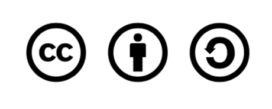

# Licence

This work is licensed under a Creative Commons Attribution-ShareAlike 4.0 International License, which means you can modify it and use it, even for commercial purposes, as long as you give credit and distribute under the same license. To view a copy of this license, visit http://creativecommons. org/licenses/by-sa/4.0/

### You are free to: 

**Share** — copy and redistribute the material in any medium or format 

**Adapt** — remix, transform, and build upon the material for any purpose, even commercially. The licensor cannot revoke these freedoms as long as you follow the license terms.

**Under the following terms:  
Attribution** — You must give appropriate credit, provide a link to the li- cense, and indicate if changes were made. You may do so in any reasonable manner, but not in any way that suggests the licensor endorses you or your use.  
**ShareAlike** — If you remix, transform, or build upon the material, you must distribute your contributions under the same license as the original.  
No additional restrictions — You may not apply legal terms or technolog- ical measures that legally restrict others from doing anything the license permits.

**Notices**: 

You do not have to comply with the license for elements of the material in the public domain or where your use is permitted by an applicable excep- tion or limitation.  
No warranties are given. The license may not give you all of the permissions necessary for your intended use. For example, other rights such as publici- ty, privacy, or moral rights may limit how you use the material.

