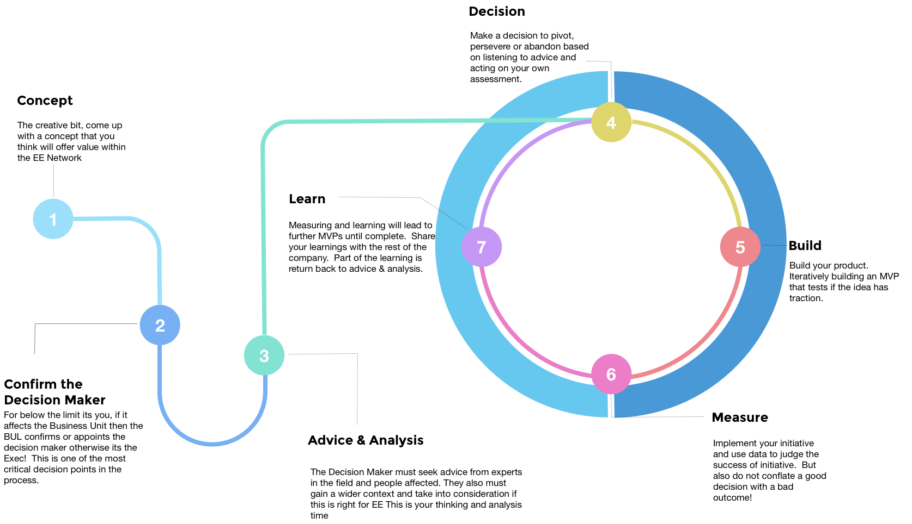
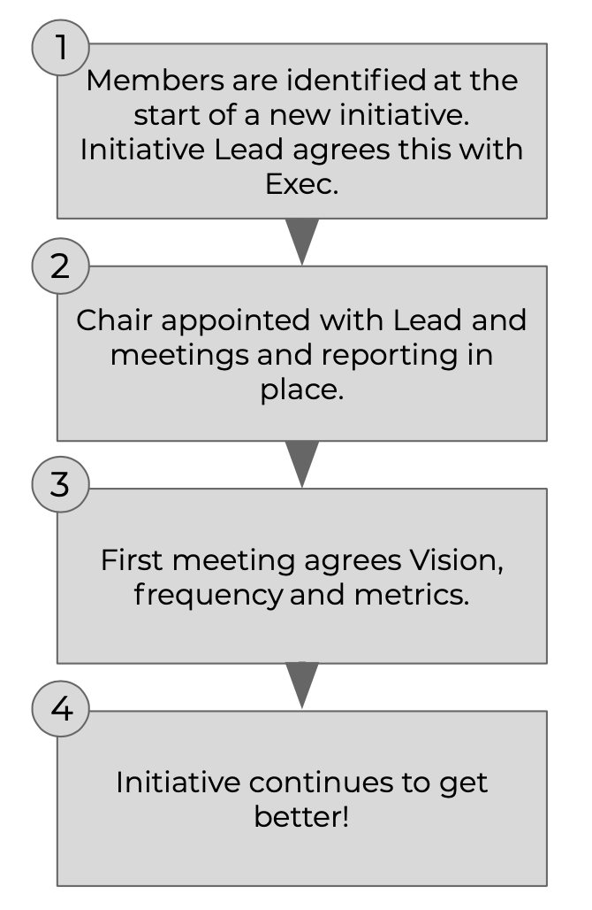

# How the AP works

## The Advice Process, illustrated

Here’s a brief overview of each stage of the AP. We’ll then explore each in more detail.

**Concept:** Someone wants to do something that involves change \(i.e. a decision that is outside standard operating procedures OR is a decision that others in the company may benefit from knowing\). Anyone can come up with a concept and we encourage them to; we want people to be creative.

**Confirm the decision maker:** Confirming the decision maker is a critical role of leaders within EE. Anyone can create an idea which is actively encouraged, but where there are material amounts of company resources in play \(whether in terms of time, money or impact\), then there are key considerations as to who takes responsibility for it \(eg. proximity to the problem, perspective / understanding of the wider context, alignment to EE values\).

**Advice & Analysis:** These constitute the main mechanics of the AP. The decision maker should be talking to people who will be impacted by the decision, and also those who are experts in the field. In other words, making the decision is not just a case of shooting from the hip, going with your gut, or relying solely on personal experience.

This stage also covers breaking up the decision into smaller parts, thinking about how to implement and test the decision \(the creation of a learning loop\). The important thing is to enter this stage with an open mind \(which may include strong opinions, loosely held\).

**Decision:** Make a decision to pivot, persevere or abandon the initiative, based on listening to advice and acting upon your own assessment. Remember this is _**your**_ decision; listen to advice, but don’t design by committee!

**Build**: Build your product. Iteratively building an MVP that tests if the idea has traction.

**Measure**: Implement your initiative and use data to judge its success \(or not\). Take care not to conflate a good decision with a bad outcome!

**Learn**: Measuring and learning will lead to further MVPs until complete. Share your learnings with the rest of the company \(eg. via our monthly AP Learnings meeting\).

## Concept creation

The creative part – come up with a concept that you think will offer value within the EE Network.

Decentralisation and empowerment is more than delegating decisions to a lower level of a hierarchy; it also means decentralisation and empowerment of ideas.

In an extreme command and control environment, when to jump and how high comes from the central command. Or, put another way, the flow of ideas originated from the command end of the system.

In contrast, highly decentralised hierarchies see ideas flow from all over the network. The idea to jump \(and how high\) might come from central command, but the idea to stand on one leg might come from elsewhere in the overall hierarchy \(jumping wasn’t the right thing to do this time\).

At Equal Experts, we want to drive towards ideas flowing from all over the network, and the Advice Process helps us to achieve this. Having a self-appointed decision maker for initiatives under a certain impact threshold is one way this works, as it helps to encourage ideas to be tested without being stopped by higher powers. For higher impact items, it is rare \(but possible\) that an initiative is stopped while confirming the Decision Maker \(the next step\).

## Confirming the decision maker

We don’t want Equal Experts to be a business where people check in their minds at the door; we want people to be engaged. After all, it’s the quality of decisions that determine the success or failure of any organisation – people are at their most creative and motivated to make good decisions when they have real control and responsibility.

There are still appointed leaders within EE – like the Exec Team and the Business Unit Leads \(BULs\) – but they don’t make all the decisions. Rather, their focus is to enable others to make decisions safely, based on a common set of data accessible to all. They do make one very important set of decisions, however: to confirm the decision maker for APs covering high value items in their area, on different decisions and projects.

The Exec / BUL of a team confirms the decision maker; it’s then that person’s decision, and they are accountable for the results and responsible for the consequences. This is because if the person who makes the decision doesn’t have any responsibility, the decision doesn’t mean anything.

### Who appoints the Decision Maker: a quick guide

* _For low-value decisions under a certain threshold \(outlined in the table below\), any employee who is part of a Business Unit \(BU\) that’s adopted the AP can appoint themselves as decision maker._
* _Above the value threshold and below £20,000, if an AP impacts a single BU, then the relevant Business Unit Lead \(BUL\) appoints the decision maker._
* _For any decision that spans across Business Units, or not covered by the two points above, the Exec Team appoints the decision maker._

### 

### High value/large impact decisions

As outlined above, the decision maker for higher value or larger impact decisions, needs to be confirmed either by the BUL or by the Exec Team. Execs will consider APs that affect more than one BU, while BULs will consider APs that impacting only their BU.

The outcome will be one of the following:

* The person that raised the AP originally is confirmed to be the decision maker. A variant on this is that the exec/BUL confirms the original person, but asks for the scope/cost of the AP to be reduced.
* Alternatively, another person takes over the AP to decide on the outcome. This new person could be the Exec or the BUL, but we recommend avoiding this if possible, so other people can be exposed to larger decisions.

**Please note:** We want APs to be as short as possible - both to encourage small steps, accelerated learning and a short payback period 1-3 months is preferable, sometimes we will tolerate up to 6 months.

### Value threshold by Business Unit

Under the listed threshold, any employee can appoint themselves the decision maker \(unless the decision is deemed to have a bigger impact, or affect more than a single BU\).

| **BU** | **BUL** | **Value GBP** | **Local Currency Value** |
| :--- | :--- | :--- | :--- |
| UK \(London / SW / North\) |  | 6,000 GBP | 6,000 GBP |
| UKSW | Andy Kemp | 6,000 GBP | 6,000 GBP |
| UK North | Andy Goundry | 6,000 GBP | 6,000 GBP |
| Germany | Nuno Marques | circa 5.5K GBP | 6,000 EUROs |
| Bengaluru | Vishwas Bhagath | circa 1.7k GBP | 1.5 lakhs |
| Pune | Ashish Jagtap | circa 1.7k GBP | 1.5 lakhs |
| ANZ | Bethan Timmins | circa 5.5K GBP | 10,000 AUD/NZD |
| US | Ryan Sikorsky | circa 5K GBP | 6,000 USD |
| Portugal | Ryan Bayly | circa 5.5K GBP | 3750 EUROs |
| South Africa | Brian Blignaut | circa 3K GBP | 50,000 ZAR |

### WIP Limits

One person can only be the decision maker for 2 on-going AP at any given time. If you want to open another AP and already have 2 APs in flight, you will have to abandon or complete existing ones, before opening another.

### 

### Transparency of Appointments

For transparency, we have a slack channel \(\#ap-bul\), where BULs are required to update the channel with all their appointments of decision makers, for those decisions above the threshold of their Business Unit.

Please update the channel each time you appoint a decision maker, along with some comment on why they are a good appointment with respect to the specific decision concerned.

### Appointing the right decision maker

Choosing who the decision maker should be is not always straightforward – just because someone has a good idea, it doesn’t mean they are the right person to take it forward. When appointing \(or self-appointing\) a decision maker, the key considerations should be:

* **Empathy.** Can this person see the problem from other people’s perspective? Are they a good listener? Do they enter conversations with an open mind?
* **Values**. Does this person understand the values of EE? Do they connect with our ‘Why’ at a deep level? Does their behaviour exemplify EE values in a consistent manner – day in, day out?
* **Tenacity.** Willingness to drive the decision to a conclusion – will this person see the decision through to the end?
* **Proximity.** Who’s close to the issue / has situational awareness? Are they well acquainted with the context, the day-to-day details? Do they have skin in the game? If the decision directly affects the decision-maker, then the outcome is no longer abstract. They don’t just want to get it right for its own sake, they want to get it right because what happens is going to impact them directly.
* **Perspective.** Proximity matters, but so does perspective. Often you need to be able to see the big picture and how this decision fits into the wider context. We have a scarce resource in both time and money – do they understand this? Sometimes an outside perspective can be just as valuable.
* **Experience.** Has this person had experience of making similar decisions? What were the consequences of those decisions?
* **Wisdom and track record.** What kinds of decisions has this person made in other areas? Do they have a history of good decisions? Do you have confidence in this person?
* **Responsibility**. Decisions have consequences, and decision-makers should be held accountable for theirs. At the same time, nobody is right all the time. The most important part of any decision is that the decision maker fully engages with the advice process, not just that he or she gets is “right”.

### Spreading decision making across the organisation

It’s perfectly OK to ask someone else to take the decision. It may well be the case that there are people who are closer to the problem that would be a better decision maker.

In order to spread the responsibilities around, people who already make many decisions at EE should seek other people that are willing to take ownership of a specific decision and let them.

We want to move away from a model where a few people are making most decisions. This is a step- by-step process that requires our active participation.

As long as other people are willing to own and implement a particular decision, they can and should be entrusted with it.

## Advice & Analysis

### Asking for advice

Decision makers are free to gather advice in whatever fashion they think is appropriate.  
Wherever possible, we recommend asking for advice as part of a conversation – whether it’s face to face \(ideally\) or Slack/phone, one-on-one or in carefully moderated small meetings. This is because we want people to have a meaningful two-way exchange, in order to increase:

* Our sense of community and the richness of our peer relationships \(the act of saying “I need you” is powerful\)
* The learning opportunity, especially for the decision maker \(discussing the pros & cons of their decisions with other people\) 

For the same reasons we’ve touched on above, we recommend to not use electronic tools to receive the advice itself, whenever possible. Instead, tools should be used to moderate the process and to record the decision \(for transparency and learning purposes\).

People should use their best judgement in order to decide who is best to ask advice from. We recommend to never ask everyone in the office for their advice, even if the decision is wide-ranging enough to warrant it. This is true even if the decision does affect everyone.

Why? Because we want the decision maker to feel accountable for their decision, as well as avoiding the trap of falling into consensus-driven decision making.

Instead, we recommend asking a representative sample of people in different roles \(both consultants and business operations\), with different levels of experience and tenure \(both old hands and new\). We also recommend recording who is asked, so we don’t end up asking the same people over and over again.

### Managing Scarce Resources

Resources have to be used wisely, and the decision to proceed needs to carefully take this into account.

### Practical advice, borne from experience

1. **Get feedback on your AP doc before publishing it on Slack.** A recommended approach is to only publish it once you’ve received feedback from those you’ve asked for advice, so you’re reasonably confident with your potential decision \(if you opt to use a dedicated slack channel to gather feedback, please use the prefix _ap-\*_, as per our Slack [naming guidelines](https://docs.google.com/document/d/1hdnf_em4e7h8qIi-ye0_8djwulHuSUerIxjthh1JtpE/edit)\).
2. **Timebox how long you’ll receive/process unsolicited feedback for.** After you publish your AP on Slack, give yourself one week \(for example\) to receive feedback from people you might not have considered to ask. How you process people’s feedback is entirely up to you though, because you’re the decision maker. You’re also accountable for the decision, so take due care and consideration in handling all feedback.
3. **Make really fast decisions \(in less than an hour\) by using the** [**AP template**](https://docs.google.com/document/d/1j9wXFM8-UGIYMdaHACBvs-FYLXJSwxjEgAmHtMU89lw/edit) **as a checklist for actions you need to take, then write it up and publish it afterwards.** We don’t want bureaucracy at EE, but we also want to avoid people shooting from the hip. We expect people to carefully consider the consequences of their decisions. The Advice Process does not add effort; it provides some of the necessary checks and balances that replace top-down decision making and potential micro-management.

### Hints & Tips

What are some of the patterns for making good decisions?

#### Making good decisions is like playing poker

_“Poker is a game of incomplete information. It is a game of decision-making under conditions of uncertainty over time. Valuable information remains hidden, and there is an element of luck in any outcome. You can make the best possible decision at every point and still lose the hand, because you don’t know what new cards will be dealt and revealed. Once the game is finished and you try to learn from the results, separating the quality of your decisions from the influence of luck is difficult.”_

_Paraphrased from Duke, Annie. Thinking in Bets: Making Smarter Decisions When You Don't Have All the Facts \(pp. 30-31\). Penguin Publishing Group. Kindle Edition._

#### 

#### Advice from a group: making it better than the sum of its individuals

The advice from a group can be better than the sum of its individuals, but only if you seek advice from the _right_ team.

We can improve the quality of decisions by promoting exploratory thought. So don’t just select people who are going to agree with you!

_“Complex and open-minded thought is most likely to be activated when decision makers learn prior to forming any opinions that they will be accountable to an audience \(a\) whose views are unknown, \(b\) who is interested in accuracy, \(c\) who is reasonably well-informed, and \(d\) who has a legitimate reason for inquiring into the reasons behind participants’ judgments / choices.”_

[_Lerner and Tetlock 2002_](https://pdfs.semanticscholar.org/1e30/cd74414cbe0f24e03cf10362fc4b7372e885.pdf)

Introduce diversity to challenge bias thinking. As Jonathan Haidt points out in his book [_The Righteous Mind: Why Good People Are Divided by Politics and Religion_](https://en.wikipedia.org/wiki/The_Righteous_Mind):

_“If you put individuals together in the right way, such that some individuals can use their reasoning powers to disconfirm the claims of others, and all individuals feel some common bond or shared fate that allows them to interact civilly, you can create a group that ends up producing good reasoning as an emergent property of the social system. This is why it’s so important to have intellectual and ideological diversity within any group or institution whose goal is to find truth.”_

Combine these two ideas and you get a blueprint for the type of people in a group you should seek advice from.

1. A focus on accuracy \(over confirmation bias\), which includes rewarding truth-seeking, objectivity, and open-mindedness within the group;
2. Accountability, for which members have advance notice; and
3. Openness to a diversity of ideas.

An agreement along these lines creates a common bond and shared fate among members, allowing the group to produce sound reasoning.

## 

## Making the Decision

If you’ve done everything as we’ve set out, this part should be pretty easy!. Make a call, go on …

## Measuring the Decision

Now comes the crucial feedback loop we prize, if we are to make progress. Build/Measure/Learn - then rinse and repeat.

Of course, this is easy to write, but the hardest thing to really crack. At this point at EE, we still haven’t really cracked this in order to get real data on the majority of our APs. So what follows is more to state where we are aiming for, rather than what we have accomplished!

In our [Advice Process template](https://drive.google.com/open?id=1j9wXFM8-UGIYMdaHACBvs-FYLXJSwxjEgAmHtMU89lw) \(see the AP Housekeeping section\), we have an area titled success metrics. The purpose of this is threefold:

1. Improve the quality of the thinking that goes into making the decision.
2. Provide a starting position, or anchor, for the build / measure / learn loop.
3. Help to de-bias future decisions, based on the result of this decision.

### Measuring impact

A significant part of the individual and organisational learning we get from a decision is through quantifying the impact of the decision. To help do this, we ask for the key hypothesis \(or Objective\) and associated tests \(or key results\) to be defined in each AP. We can use these to either test the outcome directly, or \(more likely\) show progress towards the outcome, by measuring leading indicators.

Be specific about:

1. What metrics will quantify the \(positive\) impact of this decision?
2. What are the thresholds for success and failure?
3. When and how will you take measurements?

### Hints & Tips

**Resulting correlation does not imply causation:** don’t create an overly tight relationship between results and decision quality. Just because you had a good \(or bad\) outcome, it doesn’t follow that it was a good \(or bad\) decision. It could just be down to dumb luck \(see that earlier reference to poker\).

**Break down the decision into a series of small steps**: then measure as you go. At decision time, you’re often information poor. More often than not you can break down a big decision into a series of smaller ones. If you gain new information and you end up abandoning or pivoting based on this new information, congratulations – you’ve just made a good decision.

## Governance for long-running initiatives

### Advice Process Governance

We’re investing in a number of long-running initiatives that we believe will have a positive impact on our future. These include things like new clients for existing services, completely new services for existing clients, increased visibility and industry awareness, as well as new offices in new locations. All these initiatives have been through the advice process and have people and funds committed to delivering them.

This is the simple, lightweight governance model we use to support these initiatives. It’s based on the belief that validated learning is at the heart of what we do, where an initiative has a clear vision, a governing group and agreed metrics and timescales.

Our governance is more lean start-up than corporate take-over. Its design is based heavily on the Eric Ries book [_The Startup Way_](http://www.thestartupway.com). The rule of thumb for when to use it? Any long-running AP; or any AP with a value greater than £10k. Any practice or Business Unit is required to set up a governance board.

Here’s our governance set-up:

### Governance Group Mandate

We improve the thinking of decision-makers when they are accountable to a group whose interest is in accuracy.

The governance group should:

1. Not take on Operational functions.
2. Meet at least once a quarter \(and not more than once a month\).
3. Consist of two or more people, depending on the scale of the initiative it’s overseeing..
4. Establish a chairperson to ensure that meetings happen, are minuted and reported to the AP channel.
5. The chair is responsible for following the process \(e.g. running the checkpoint meeting\).
6. The Initiative Lead determines if the AP continues.

The intent is that the people doing the governance are different from initiative to initiative. And people are not part of more than two governance processes at any point in time..

#### Hints & Tips

**What would make a good critical friend?** At least one of your critical friends needs to understand the build &gt; measure &gt; learn loop \(and be able to challenge the measures\), and at least one should have some experience in the domain \(e.g. if setting up a new office, get someone who has done it before\). Critical friends need to be motivated, excited and/or interested in the project and able to assess if the initiative is in line with the company's purpose.

**Can anyone be a critical friend?** Yes – including non-permanent staff, or even people outside EE. But the initiative lead needs to agree the person with the BUL or Exec.

**What does the critical friend get out of this?** Experience in helping to run these types of processes, and an opportunity to get involved in initiatives that they might be interested in.

**How do you select a critical friend?** Work out who would be good based on the above, and start having a conversation!

**What happens if I lose one of my critical friends?** Initially, try and recruit another. If you can’t, then have a conversation with the BUL or Exec. If they are leaving because they don’t buy into the project anymore, this may be a sign that the project is not viable.

**What if the critical friends disagree with the initiative lead’s view on something critical – such as whether to continue investing?** The critical friend should quit. This should prompt a conversation with the BUL or Exec as to why it happened.

**How do I know when to stop the governance process?** When investment stops, or the initiative concerned is embedded into BAU \(as agreed by the governance group\).

**What if the initiative fails?** Failures aren’t fun, but they also don’t matter. What does matter is that we continue to experiment, because “companies that don’t embrace failure eventually get into a desperate position, where the only thing they can do is make a ‘Hail Mary’ bet at the very end of their corporate existence. We don’t believe in bet-the-company bets”. - _Jeff Bezos, Amazon Founder/CEO_

**Can I change my critical friend?** Yes, but the new arrangement needs to be agreed by the BUL or Exec, and the other critical friends.

