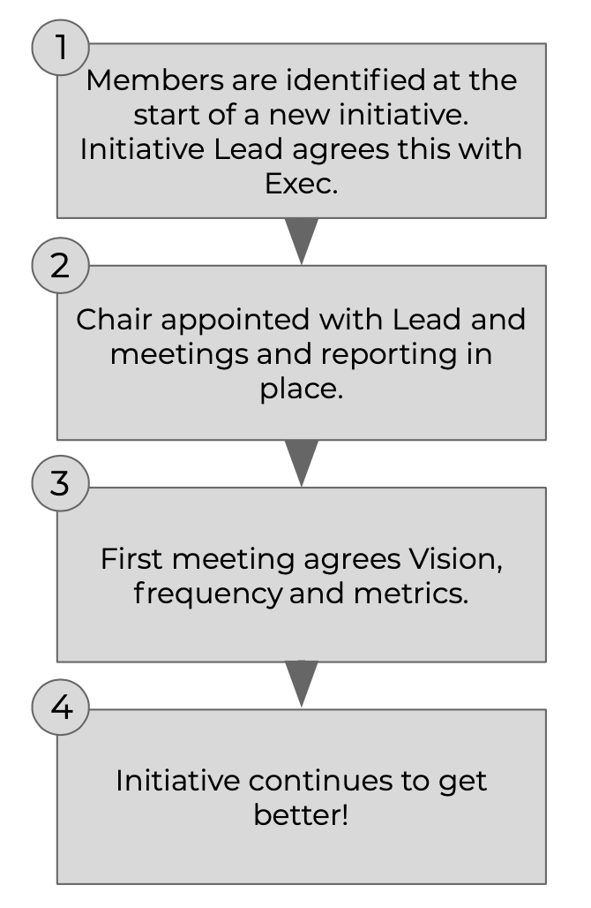

# Governance for long-running initiatives

## Advice Process Governance

We’re investing in a number of long-running initiatives that we believe will have a positive impact on our future. These include things like new clients for existing services, completely new services for existing clients, increased visibility and industry awareness, as well as new offices in new locations. All these initiatives have been through the advice process and have people and funds committed to delivering them.

This is the simple, lightweight governance model we use to support these initiatives. It’s based on the belief that validated learning is at the heart of what we do, where an initiative has a clear vision, a governing group and agreed metrics and timescales.

Our governance is more lean start-up than corporate take-over. Its design is based heavily on the Eric Ries book [_The Startup Way_](http://www.thestartupway.com). The rule of thumb for when to use it? Any long-running AP; or any AP with a value greater than £10k. Any practice or Business Unit is required to set up a governance board.

Here’s our governance set-up:

### Governance Group Mandate

We improve the thinking of decision-makers when they are accountable to a group whose interest is in accuracy.

The governance group should:

1. Not take on Operational functions.
2. Meet at least once a quarter \(and not more than once a month\).
3. Consist of two or more people, depending on the scale of the initiative it’s overseeing..
4. Establish a chairperson to ensure that meetings happen, are minuted and reported to the AP channel.
5. The chair is responsible for following the process \(e.g. running the checkpoint meeting\).
6. The Initiative Lead determines if the AP continues.

The intent is that the people doing the governance are different from initiative to initiative. And people are not part of more than two governance processes at any point in time..

#### Hints & Tips

**What would make a good critical friend?** At least one of your critical friends needs to understand the build &gt; measure &gt; learn loop \(and be able to challenge the measures\), and at least one should have some experience in the domain \(e.g. if setting up a new office, get someone who has done it before\). Critical friends need to be motivated, excited and/or interested in the project and able to assess if the initiative is in line with the company's purpose.

**Can anyone be a critical friend?** Yes – including non-permanent staff, or even people outside EE. But the initiative lead needs to agree the person with the BUL or Exec.

**What does the critical friend get out of this?** Experience in helping to run these types of processes, and an opportunity to get involved in initiatives that they might be interested in.

**How do you select a critical friend?** Work out who would be good based on the above, and start having a conversation!

**What happens if I lose one of my critical friends?** Initially, try and recruit another. If you can’t, then have a conversation with the BUL or Exec. If they are leaving because they don’t buy into the project anymore, this may be a sign that the project is not viable.

**What if the critical friends disagree with the initiative lead’s view on something critical – such as whether to continue investing?** The critical friend should quit. This should prompt a conversation with the BUL or Exec as to why it happened.

**How do I know when to stop the governance process?** When investment stops, or the initiative concerned is embedded into BAU \(as agreed by the governance group\).

**What if the initiative fails?** Failures aren’t fun, but they also don’t matter. What does matter is that we continue to experiment, because “companies that don’t embrace failure eventually get into a desperate position, where the only thing they can do is make a ‘Hail Mary’ bet at the very end of their corporate existence. We don’t believe in bet-the-company bets”. - _Jeff Bezos, Amazon Founder/CEO_

**Can I change my critical friend?** Yes, but the new arrangement needs to be agreed by the BUL or Exec, and the other critical friends.

