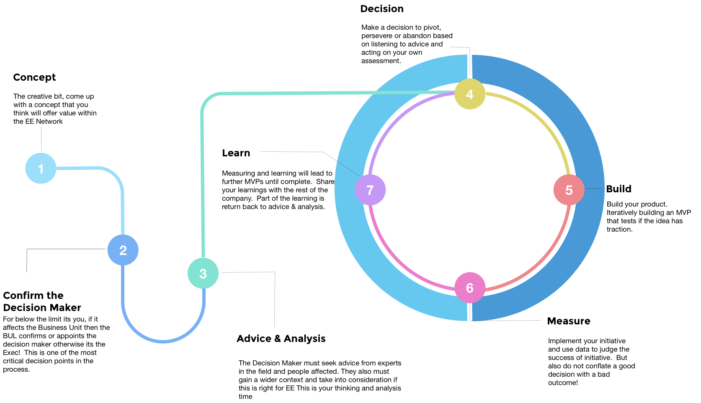
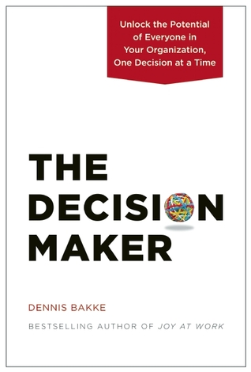
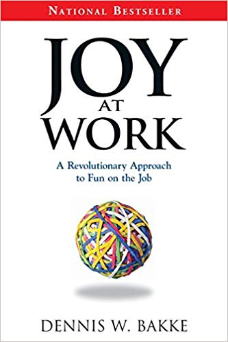
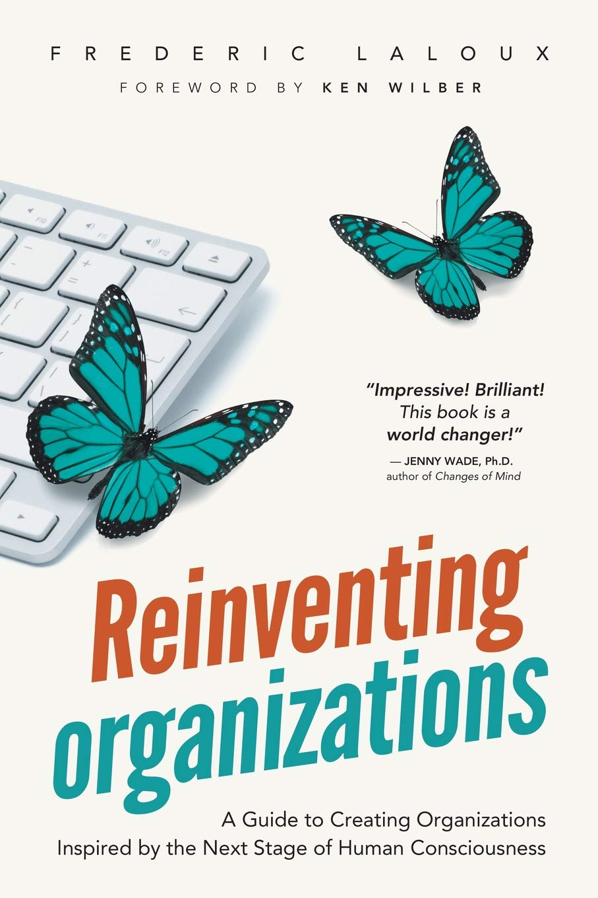
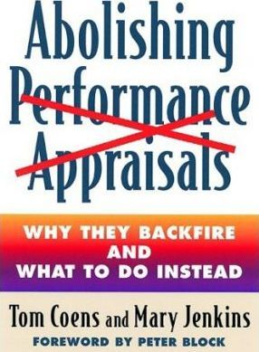
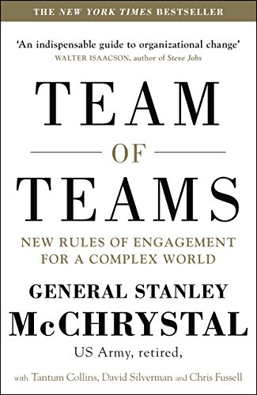

# Untitled

Advice Process Playbook

[Thomas de Cad'oro Granier](https://www.linkedin.com/in/thomasgranier/), [Dave Hewett,](https://www.linkedin.com/in/dave-hewett-b97609) [Chris Cobb](https://www.linkedin.com/in/chris-cobb-88981a1/) and [Lyndsay Prewer](https://www.linkedin.com/in/lyndsp/)

[www.playbook.ee](http://www.playbook.ee)

Introduction

**We wrote this playbook to share our ongoing experience of a real-world implementation of the Advice Process at Equal Experts, and related non-conventional approaches to running a company.**

This playbook is written for two audiences - people working within the Equal Experts network \(EE\), who want to learn more about the Advice Process \(AP\), and those outside our organisation who are curious to learn more about how it works \(possibly with a view to trying it within their own organisations\).

If you’re in the latter group, you can learn more about Equal Experts at our website, [equalexperts.com](https://equalexperts.com).

As our understanding of how to run EE matures, we’ve come to a point where we’re more confident about presenting some of the less mainstream ways that we work within the network. We’ve long talked about providing a haven or a place where we treat people like grown-ups, but words are wind; these ambitions only become real once you start to change your policies and working practices to align with them.

This playbook reflects on our journey so far, and provides a few hints and tips for any other organisations that may wish to break out of the increasingly outdated management practices that we’re all so used to.

While there are some great books that outline alternative management practices, we’ve found there’s a limited number of real-world examples of performing the changes described at **scale** \(notable exceptions include AES, [Morning Star](http://morningstarco.com/index.cgi?Page=Self-Management) and [Buurtzorg](https://www.buurtzorg.com/about-us/buurtzorgmodel/)\). As Equal Experts’ turnover now passes £100 million, with offices around the world, we hope this playbook will add to the collection of case studies.

The backbone of our management practices is based on the Advice Process as described by Dennis W. Bakke in [Joy at Work: A Revolutionary Approach To Fun on the Job](https://www.goodreads.com/en/book/show/362307.Joy_at_Work). We’ve learnt new things along our journey and so have adapted various parts to suit our needs and particular context.

## What is the Advice Process?

Companies of a certain size need some kind of corporate governance; the Advice Process is ours. It’s an unusual way to approach governance – because it empowers any EE employee to make meaningful decisions, rather than wait to be told what to do \(as with a traditional top-down or consensus-driven arrangement\).

Instead of having to refer ‘up’ all the time when faced with decisions, as its name suggests the Advice Process simply requires people to ask for advice from appropriate colleagues. This should be a tremendously empowering thing for all of us \(especially when we consider that the common alternative is the traditional top-down model, with investment committees, long proposals and 100 hoops to jump through whenever you want to try and use your initiative\).

The Advice Process means that power isn’t held in the hands of an elite few at Equal Experts; decision-making is spread across the organisation. But distributing power across organisations is hard, so it’s up to everyone in EE to make this work. We don’t want to end up as just another consultancy!

### A word of advice

With the Advice Process, before a person can make a decision they must seek advice from affected parties and people with expertise on the matter.

To be clear, it’s _not_ about gaining consensus – rather, it creates a framework which allows people to seek advice, then own and execute on decisions for which they are accountable and responsible for the outcome..

Currently, the AP applies to our UK employees and employees of any other Business Unit \(BU\) that chooses to adopt it. In time, we believe it is important to develop this kind of decision making across EE. It fits with our culture and values. It provides autonomy and treats people like grown-ups. And it enables us to keep a mostly flat hierarchy.

To fulfill its purpose, the Advice Process needs to achieve the following:

1. **Collaboration** - the decision maker needs to actively listen to other people \(both knowledgeable and affected people\) to improve his or her decision. Those people consulted have to actively help the decision maker to make a better decision.
2. **Accountability** - the decision maker needs to be held accountable for their decision by the rest of the organisation.
3. **Transparency** - the AP should bring an increased level of transparency to decision-making across the organisation
4. **Feedback and Learning** - we need to measure the outcome of decisions made via the AP, and learn from our decisions \(both as individuals, and as an organisation\).

_“Advice received must be taken into consideration. The point is not to create a watered-down compromise that accommodates everybody’s wishes. It is about accessing collective wisdom in pursuit of a sound decision. With all the advice and perspectives the decision maker has received, they choose what they believe to be the best course of action.”_

_"It is a misunderstanding that self-management decisions are made by getting everyone to agree, or even involving everyone in the decision. The advice seeker must take all relevant advice into consideration, but can still make the decision. "_

 _–_ [_Reinventing Organizations Wiki_](http://www.reinventingorganizationswiki.com/Decision_Making)

## Why we use the Advice Process

We first began experimenting with the AP in April 2016. Around that time, EE’s mission statement read something like this:

_"Equal Experts was created to be a haven where people are comfortable enough to be themselves, in an environment where there is support and mutual respect for you and your peers. In a self-organising environment, autonomy is given but in return we are expected to take personal responsibility and hold ourselves accountable for achieving our mission. Above all, we are expected to do the right thing by your colleagues and customers."_

Of course, mission statements are only useful if they actually drive behaviours and instruct involved parties on how to operate the organisation.

Our statement touched on a number of areas, including company policies and organisational structure. But at the heart of it all is how we make decisions within Equal Experts, and who makes them.

We needed a framework to guide this decision-making process; the Advice Process is that framework. In other words, it’s the method by which we ensure we are actually living our values.

## Who is this playbook for?

It’s for anyone that’s interested in the Advice Process – both inside Equal Experts and outside.

**Inside EE?**

A key reason this playbook exists is to support employees inside Equal Experts and provide an overview of the processes we use, so new starters can gain context and support. It’s also for old hands who want a refresher on how to do things \(not everyone will need to run an AP regularly\).

If you make decisions in your day to day job \(which we all do\) this will be relevant to you. It’s more than just seeking advice – it's about corporate governance \(in an accessible, non-boring way, hopefully\). It’s intended to help us manage ongoing change while continuing to run the company in an un-corporate way – and keep the network recognisably ‘us’ as we continue to grow.

**Outside EE?**

It’s our hope that this playbook might also provide a template or framework for any other people and/or organisations who are **outside** the Equal Experts network, who are looking for a real-world guide to implementing the Advice Process \(or something like it\). At the very least, hopefully some element of our experience may inform your own efforts. We have released this playbook under [Creative Commons Attribution-ShareAlike 4.0 International License](http://creativecommons.org/licenses/by-sa/4.0/) which means you can modify it and use it, even for commercial purposes, as long as you give credit and distribute under the same license.

## Using this Playbook

The Playbook is broken down into several sections.

**Background**

An overview of the Advice Process and why we think this system of management works, plus an outline of advantages we’ve seen and some pitfalls to avoid. Read this section if you are new to the Advice Process and want to gain some general context about what it is, and what it isn’t.

**How the Advice Process works**

A more detailed look at each step in the process as followed by EE, together with some relevant theory, real-world experiences and tips. If you’re an EE employee, this is the process to follow to get investment into ideas and how you make change within; if you’re external, this is our real world example of the AP in action.

**Run an AP**

This section is based on the practicalities - detailing what you actually need to do to run an AP, and in what order,

**AP Housekeeping**

In this section, you’ll find useful templates and a rundown of the various Slack channels we use to administer and discuss APs within EE.

**Even more AP**

For those researching the possibility of adopting their own Advice Process, or just those who can’t get enough of innovative business management \(hey, it happens\), we’ve shared some of the reference material that’s informed us over the last few years. You’ll also find ways to contact us to discuss all this in more detail, or let us know what you think of this playbook \(we’d love to hear from you!\).

Background

## Benefits of the Advice Process

_“The more decisions I made, the less engaged others become, and the less ownership they had in the results”_

_-_ [_Dennis_](https://www.slideshare.net/pearpress/the-decisionmaker-dennisbakkeppt) [_Bakke_](https://www.slideshare.net/pearpress/the-decisionmaker-dennisbakkeppt)

All this AP business would seem a lot of effort, if there weren’t significant benefits to putting such a process in place. Thankfully, there are. Here’s a rundown.

**Collaboration**

* Everyone becomes more engaged: people feel more ownership when their advice is sought. Even if their advice isn't followed, at least they feel heard and part of the process.
* When decisions involve more people who are fully engaged, an organisation has a higher chance of a good outcome than it does with a conventional top-down approach, thanks to greater levels of buy-in.

**Accountability**

* When decisions are made by the people who are closest to the problem, they understand the context. Another factor in increasing the likelihood of success of an initiative.
* With full accountability comes ownership; people are more inclined to work towards the success of the project, as if it were their own.

**Transparency**

* Transparency ensures the process is self-policing – if you’re worried about what other people might think about your decision, then perhaps it's not such a great decision \(or demands further consideration\).
* It’s harder to not give the advice process its proper attention when others are looking in.
* Transparency is a prerequisite to ensure we don’t descend into chaos. Where decisions have wide impact, a visible decision-making process helps those impacted to understand what/how/why something is happening.
* Transparency aligns decision making in terms of consistency, in the absence of a central decision-making authority.
* Transparency helps people learn how to make better decisions \(especially if we come back to decisions retrospectively to record the results\). This is the point of the advice process, to help people become better decision makers on management-like decisions.
* Transparency provides a wider organisational context, helping to reduce waste and providing the platform to make better decisions.

**Feedback and Learning**

* Decisions that are made by people who are closest to the action receive faster feedback on the outcome, therefore providing a faster learning loop.
* The AP provides ongoing on-the-job education – no training can match real-world experience.

## The Process in a Picture

## When to use the Advice Process

**Using the Advice Process is all about managing change. So if you’re trying to change something in the organisation, you should consider using the AP.**

If you’re **making a decision that someone else should know about**, consider using the Advice Process.

If you are **trying something for the first time**, consider using the Advice Process. The AP helps us learn, both as individuals and as an organisation. If you want to do something that you’ve not seen done before at EE, or is not considered business-as-usual within the company, consider using the AP. It might seem like a very familiar decision for you, but it’s not just about you; it’s about helping the rest of EE learn.

The AP improves communication and transparency, and clarifies accountability. Ultimately we’d like to see the AP become _**our preferred form of communicating any decisions**_.

The Advice Process should add value, not bureaucracy. If you’re making a decision and don’t see any way the AP will create value – from anyone’s perspective – then don’t use it. If you’re not sure, ask. If you’re still not sure, try. The downside is low, the upside high.

So let’s experiment!

## The principles to get behind

There are some key principles and assumptions that underpin the Advice Process – and they run counter to traditional corporate models. It’s important that you \(and your colleagues!\) buy into these if the Advice Process is to succeed.

You need to believe that people are:

* Grown-ups and want to be treated as such.
* Care about doing the right thing for the company.
* Capable of providing insights and perspectives.
* Capable of making decisions.
* Unique and creative thinkers.
* Capable of learning, and up for a challenge.

Let’s be honest – in some organisations, these concepts would be difficult to embed. However, we’re fortunate at Equal Experts in that we’ve long encouraged this kind of thinking; our co-founder Thomas de Cad’oro Granier has long expressed a desire for EE to be a ‘company of grown-ups’, an attitude that naturally dovetails with the kind of thinking above.

Whilst many large companies will talk about similar principles, the proof is in how they are executed. They need to be the reality if the AP is to work.

**Pro tips:**

* People aren’t perfect – we are all fallible, no matter where we fall in the hierarchy or how long we’ve been within the organisation.
* It’s hard to let go as a boss and trust and empower people. Do not underestimate how easy it is to slip back into the old ways

## Adoption pains

Adopting a management system like the Advice Process doesn’t happen overnight. Even within EE, where we have intelligent, free-thinking people, there were many bumps in the road. The main problems we encountered were around the transition of power, permission seeking and dealing with the tyranny of structurelessness.

### Dealing with Uncertainty

A side effect of the Advice Process is that power and control is distributed widely throughout the company. This transition can be particularly difficult for those used to making decisions on behalf of others. Passing decision-making onto others brings uncertainty and feelings of lack of control, which may be uncomfortable for some. Over time, most people adjust to this new way of working, but if it completely goes against your grain, EE may not be the right fit for you.

### Permission Seeking

The counter side to managers letting go is team members defaulting to the reflex of permission seeking. If you are the one who is being asked “for permission” then try not to just make a call but rather use this as a teachable opportunity. Ask questions about the problem, who are experts in the area, who might be affected and help them think about measuring the outcomes and reflecting on the learning. Basically, give them the tools and help them understand how to use them.

### Drawing the Line

Another regular bump in the road we encounter is drawing the line between decisions that are small, fast or low-risk enough to incorporate in our everyday work versus those that benefit from the investment, transparency and consultation of using the Advice Process. The same conflict occurs when faced with decisions that are larger, but fall within one’s existing responsibilities. Using the Advice Process doesn’t come for free, so the benefits its usage brings need to be weighed up against the cost. Often we’ll apply the principles of the Advice Process \(e.g. soliciting advice, enumerating the costs and success metrics\), without formally writing up and publishing the decision. This is a blurred line that we still haven’t got totally right and can generate some confusion; something we continue to work on.

## The Advice Process protocol

It’s important to understand where the Advice Process fits into different decision-making frameworks. Because we talk about flat organisations and distributed decision-making, people often make misplaced assumptions about the AP; hopefully this section will help to frame where it sits in the overall picture.

### Different protocols for making decisions

The Advice Process is not about gaining consensus, consent or winning a popular vote to proceed with a given action. But it also differs from the traditional, top-down, ‘_I have a mandate_’ model that exists in most organisations today.

The messy reality of life is that people have things they prefer \(“I want apples”\), things they will tolerate \(“I could have any fruit”\) and things they object to \(“I won’t eat junk food”.\) On a basic level, this can be applied to the different decision-making protocols to highlight how each approach is impacted by group dynamics, as shown below.

| **Only me** | **Me and someone else** | **The messy real world...** |
| :--- | :--- | :--- |
|  |  |  |

From: [London - Decentralised Decision Making - April 2019](https://docs.google.com/presentation/d/1coels2ur22VV9Hpmy02WTlYY-QIJ5rayWtv75hQYb8E/edit?usp=sharing)

### Outline of the Different Protocols

| **Decision protocol** | **How the decision is made** |
| :--- | :--- |
| Consensus | Seeks as much agreement as possible, so there is a general agreement around the proposal. Impact: your proposal moves to match that of the group despite your preference. |
|  |  |
| Consent | Seeks to remove objections or gain ‘permission’ on the proposal; “I’ll proceed if no one objects.” Impact: If you can’t remove objections to your proposal, then it fails to proceed. |
|  |  |
| Democratic | Seeks to bring a proposal to the point where a simple majority prefer or tolerate it. Impact: Your proposal moves to where you think you can gain sufficient support to proceed. |
|  |  |
| **Advice \(Process\)** | **Seeks input, which influences the decision maker’s preference. Decision then made based on that preference. Impact: Your decision aligns with what you think is the** _**best course of action for the proposal, given the advice you’ve received.**_ |
|  |  |
| Mandate | Decision made within the boundaries of decision maker’s role. “I’ll proceed if I prefer.” Impact: The proposal aligns with the decision maker’s preference, but often without testing the proposal. |
|  |  |

### Different Characteristics of the Different Protocols

In the ‘Benefits of the Advice Process’ section above, we identified four key aspects EE is looking for when making decisions. **Collaboration**, **Accountability**, **Transparency** and an opportunity for **Feedback and Learning.** Here’s how each of the protocols stacks up against those requirements – it’s fairly obvious why we chose the Advice Process.

|  | **Collaboration** | **Accountability** | **Transparency** | **Feedback & Learning** |
| :--- | :--- | :--- | :--- | :--- |
| **Consensus** | YES | NO | YES | ? |
| **Consent** | YES | NO | YES | ? |
| **Democratic** | YES | NO | YES | ? |
| **Advice \(Process\)** | YES | YES | YES | YES |
| **Mandate** | NO | YES | NO | ? |

### 

#### Advice vs. Consensus, Consent & Democratic Protocols

As outlined in the table, the core difference between the Advice Process and Consensus, Consent & Democratic Protocols is the focus on **Accountability**. This is important, because when looking to drive an initiative though what are essentially voting systems, you end up getting the worst of all worlds:

* The initiative that the person is driving ceases to be their own, and turns into a watered-down set of compromises that no one can love or get passionate about.
* In the event of running the initiative, it becomes easy to shirk responsibility because the ideas are not fully the owners.

In contrast, with the Advice Process:

* The Decision Maker is clearly accountable for the outcome. They are under no obligation to implement the advice given \(only to listen with an open mind\), so it’s very clear where accountability and responsibility lie.
* People are motivated when they feel they have ownership of what’s happening. That ownership just doesn’t exist in the same way with a vote.
* People work hard to make the right decision when they are clearly accountable.

_“In the Advice Process when someone only gets to give advice, they know someone heard what they had to say. They made their case. They had a conversation. They didn’t just cast a ballot.”_[_\[1\]_]()

#### 

#### Advice vs. Mandate

Like the Advice Process, accountability is clear when using a Mandate protocol. However, it cannot offer anywhere near the same level of **collaboration** or **transparency**. With collaboration – including advice from experts and those motivated to contribute due to the impact on them – the quality of decision making will only increase. And with transparency, the decision-maker will be motivated to make the best decision possible, and be prepared to own it. For us at Equal Experts, it’s just not acceptable to do away with either of these aspects.

## Pirate or navy? The empowerment of teams and the decentralisation of decision making

Generally, teams perform better when they’re able to apply their collective brainpower to problems and are given the autonomy to take action, rather than having solutions dictated to them.

However, there are times when this model falls apart; teams given this freedom can end up spinning around in circles, wasting time and effort performing unnecessary tasks. Too often the organisation’s central command-and-control impulse then kicks in, the autonomy is removed and the initiative is written off as some crazy agile experiment that was doomed to fail from the beginning.

A key reason behind our adoption of the Advice Process is that it brings additional benefits around decentralisation and provides genuine empowerment to make decisions.

Usually, when people talk about decentralisation and empowerment, they mean delegating decisions to a lower level in a hierarchy; however this is only part of the picture. We can illustrate what we mean with the metaphor of a navy vs. pirates \(arrr!\).

A simplified decentralisation model would look at who makes the most important decisions \(and who can overrule the decisions made by others\).

With this model you can clearly see where pirates are in relation to the navy, and in recent years IT practices have tended towards being more pirate, with agile teams allowing for quicker decision making. However, when we look back in history, the navy ends up winning. It could co-ordinate ships and assets more effectively, Blackbeard was vanquished and the golden age of pirates came to an end. So does that mean that highly centralised always beats highly decentralised?

**A new model**

The big advantage that the navy has over the pirate is being able to create and own the big-picture view that enables them to make better strategic decisions. Information is generated in nodes, then flows into the central command, thus allowing a strategic picture to be created. Decisions made locally are small and can be overridden by central command, but that’s the trade-off for running top-down strategy.

Compare this to the pirate model, where bigger decisions are made in the places where the information is generated. This creates the ability to respond in a highly agile way, but building up the big picture is hard because the information doesn’t flow around the network and no single node has the necessary context to create a strategy.

To create the best of both worlds you need to become more like the SBS \(or for our American cousins the Navy Seals\) - highly-connected but autonomous special forces of the sea. In this way, agility is maintained as decisions are made where the action is. However, the local nodes share information and are highly connected, and by giving them access to the big-picture context it allows them to make high-quality strategic decisions.

#### Centralised v decentralised

<table>
  <thead>
    <tr>
      <th style="text-align:left"><b>Independent, decentralised decision makers (Pirate)</b>
      </th>
      <th style="text-align:left"><b>Independent, decentralised decision makers, with highly connected decision information</b>
      </th>
      <th style="text-align:left"><b>Centralised decision maker (Navy)</b>
      </th>
    </tr>
  </thead>
  <tbody>
    <tr>
      <td style="text-align:left">
        
      </td>
      <td style="text-align:left">
        
      </td>
      <td style="text-align:left">
        
      </td>
    </tr>
    <tr>
      <td style="text-align:left">
        <ul>
          <li>Highly agile</li>
          <li>Decisions made directly by those on the ground</li>
        </ul>
      </td>
      <td style="text-align:left">
        <ul>
          <li>Highly agile</li>
          <li>Decisions made directly by those on the ground</li>
          <li>Information network feed to the decision makers</li>
          <li>Decision makers have big picture awareness and context</li>
        </ul>
      </td>
      <td style="text-align:left">
        <ul>
          <li>Information network feed to the decision makers</li>
          <li>Decision makers have big picture awareness and context</li>
        </ul>
      </td>
    </tr>
    <tr>
      <td style="text-align:left">
        <ul>
          <li>Decision makers lack big picture awareness</li>
          <li>Limited channels of information between decision makers</li>
        </ul>
      </td>
      <td style="text-align:left">
        <ul>
          <li>HIgh effort communications channels between decision makers</li>
        </ul>
      </td>
      <td style="text-align:left">
        <ul>
          <li>Limited agility &amp; pace of local response</li>
          <li>Decisions made by indirect decision makers (those without local awareness)</li>
        </ul>
      </td>
    </tr>
  </tbody>
</table>**How to navigate the high seas**

The first key take-away: to truly benefit from a decentralised decision-making process, decision makers must have access to information that allows them to make a high-quality decision. This is more than the local, situational awareness that comes with ‘being on the ground’ but does include the decentralised teams knowing the wider strategic context.

If they don’t want to go the way of the golden age pirates, those further up in the hierarchy must ensure high-quality information flows freely around the network, and access to experts, hierarchy and organisational information must not be restricted as it’s key to maintaining a decentralised model. This flow of information must come from all directions - it’s not only the responsibility of “The Management”. Teams also have an obligation to share information about their local context with the wider organisation.

**Trust those on deck**

Once a high-quality information flow is in place, a second key take-way is that those further up the hierarchy must trust the local decision makers to use this information to make the right decision. Even if decision-makers are given all the information they could possibly need, it won’t make a difference if central command doesn’t trust them to make decisions on behalf of the organisation. If trust isn’t there, the decentralised model will revert to command and control.

Maintaining information flow across the organisation takes time and effort - it’s not something that just happens. If you want individuals or teams to operate autonomously then they must know what’s going on. Context takes time to build, and involves information that initially might not seem relevant only to become so at a later date. Right from the top, try to operate as much as possible in the open, share your high level strategy and embed it into cultural fabric. Let people know the bad news as well as the good, start sharing stories and use tools that invite the free flow of information. Expecting teams to be autonomous and strategic is possible, but only with this added effort.

Revolutions fail because those that come into power afterwards are the ones that are best organised and control communication, \(often the same group that was recently overthrown!\) So to keep the revolution going, encourage your teams to share local context and give them the right strategic information. If you then trust them to act in your best interests, autonomous teams have a real chance of succeeding.

**Pro tips: measuring decentralisation and empowerment of decision making.**

At Equal Experts we hold a log of all APs published. This allows us to answer the following questions:

* In the past month, what percentage of the employed base have published an AP?
* In the past month, what is the total value / average value / count of AP for Leadership / Non-leadership roles?
* In the past 12 months how many AP decisions have been overturned by “Leadership”?

<table>
  <thead>
    <tr>
      <th style="text-align:left">
        
      </th>
      <th style="text-align:left">
        
If distribution of decisions is desired then:

        <ul>
          <li>APs created by non-leadership roles should have an &#x201C;average value&#x201D;
            that is tending towards that of leadership roles.</li>
          <li>Volume of APs created should bias towards non-leadership roles over time.</li>
        </ul>
      </th>
    </tr>
  </thead>
  <tbody></tbody>
</table>How the AP works

## The Advice Process, illustrated

Here’s a brief overview of each stage of the AP. We’ll then explore each in more detail.

**Concept:** Someone wants to do something that involves change \(i.e. a decision that is outside standard operating procedures OR is a decision that others in the company may benefit from knowing\). Anyone can come up with a concept and we encourage them to; we want people to be creative.

**Confirm the decision maker:** Confirming the decision maker is a critical role of leaders within EE. Anyone can create an idea which is actively encouraged, but where there are material amounts of company resources in play \(whether in terms of time, money or impact\), then there are key considerations as to who takes responsibility for it \(eg. proximity to the problem, perspective / understanding of the wider context, alignment to EE values\).

**Advice & Analysis:** These constitute the main mechanics of the AP. The decision maker should be talking to people who will be impacted by the decision, and also those who are experts in the field. In other words, making the decision is not just a case of shooting from the hip, going with your gut, or relying solely on personal experience.

This stage also covers breaking up the decision into smaller parts, thinking about how to implement and test the decision \(the creation of a learning loop\). The important thing is to enter this stage with an open mind \(which may include strong opinions, loosely held\).

**Decision:** Make a decision to pivot, persevere or abandon the initiative, based on listening to advice and acting upon your own assessment. Remember this is _**your**_ decision; listen to advice, but don’t design by committee!

**Build**: Build your product. Iteratively building an MVP that tests if the idea has traction.

**Measure**: Implement your initiative and use data to judge its success \(or not\). Take care not to conflate a good decision with a bad outcome!

**Learn**: Measuring and learning will lead to further MVPs until complete. Share your learnings with the rest of the company \(eg. via our monthly AP Learnings meeting\).

## Concept creation

The creative part – come up with a concept that you think will offer value within the EE Network.

Decentralisation and empowerment is more than delegating decisions to a lower level of a hierarchy; it also means decentralisation and empowerment of ideas.

In an extreme command and control environment, when to jump and how high comes from the central command. Or, put another way, the flow of ideas originated from the command end of the system.

In contrast, highly decentralised hierarchies see ideas flow from all over the network. The idea to jump \(and how high\) might come from central command, but the idea to stand on one leg might come from elsewhere in the overall hierarchy \(jumping wasn’t the right thing to do this time\).

At Equal Experts, we want to drive towards ideas flowing from all over the network, and the Advice Process helps us to achieve this. Having a self-appointed decision maker for initiatives under a certain impact threshold is one way this works, as it helps to encourage ideas to be tested without being stopped by higher powers. For higher impact items, it is rare \(but possible\) that an initiative is stopped while confirming the Decision Maker \(the next step\).

## Confirming the decision maker

We don’t want Equal Experts to be a business where people check in their minds at the door; we want people to be engaged. After all, it’s the quality of decisions that determine the success or failure of any organisation – people are at their most creative and motivated to make good decisions when they have real control and responsibility.

There are still appointed leaders within EE – like the Exec Team and the Business Unit Leads \(BULs\) – but they don’t make all the decisions. Rather, their focus is to enable others to make decisions safely, based on a common set of data accessible to all. They do make one very important set of decisions, however: to confirm the decision maker for APs covering high value items in their area, on different decisions and projects.

The Exec / BUL of a team confirms the decision maker; it’s then that person’s decision, and they are accountable for the results and responsible for the consequences. This is because if the person who makes the decision doesn’t have any responsibility, the decision doesn’t mean anything.

### Who appoints the Decision Maker: a quick guide

* _For low-value decisions under a certain threshold \(outlined in the table below\), any employee who is part of a Business Unit \(BU\) that’s adopted the AP can appoint themselves as decision maker._
* _Above the value threshold and below £20,000, if an AP impacts a single BU, then the relevant Business Unit Lead \(BUL\) appoints the decision maker._
* _For any decision that spans across Business Units, or not covered by the two points above, the Exec Team appoints the decision maker._

### 

### High value/large impact decisions

As outlined above, the decision maker for higher value or larger impact decisions, needs to be confirmed either by the BUL or by the Exec Team. Execs will consider APs that affect more than one BU, while BULs will consider APs that impacting only their BU.

The outcome will be one of the following:

* The person that raised the AP originally is confirmed to be the decision maker. A variant on this is that the exec/BUL confirms the original person, but asks for the scope/cost of the AP to be reduced.
* Alternatively, another person takes over the AP to decide on the outcome. This new person could be the Exec or the BUL, but we recommend avoiding this if possible, so other people can be exposed to larger decisions.

**Please note:** We want APs to be as short as possible - both to encourage small steps, accelerated learning and a short payback period 1-3 months is preferable, sometimes we will tolerate up to 6 months.

### Value threshold by Business Unit

Under the listed threshold, any employee can appoint themselves the decision maker \(unless the decision is deemed to have a bigger impact, or affect more than a single BU\).

| **BU** | **BUL** | **Value GBP** | **Local Currency Value** |
| :--- | :--- | :--- | :--- |
| UK \(London / SW / North\) |  | 6,000 GBP | 6,000 GBP |
| UKSW | Andy Kemp | 6,000 GBP | 6,000 GBP |
| UK North | Andy Goundry | 6,000 GBP | 6,000 GBP |
| Germany | Nuno Marques | circa 5.5K GBP | 6,000 EUROs |
| Bengaluru | Vishwas Bhagath | circa 1.7k GBP | 1.5 lakhs |
| Pune | Ashish Jagtap | circa 1.7k GBP | 1.5 lakhs |
| ANZ | Bethan Timmins | circa 5.5K GBP | 10,000 AUD/NZD |
| US | Ryan Sikorsky | circa 5K GBP | 6,000 USD |
| Portugal | Ryan Bayly | circa 5.5K GBP | 3750 EUROs |
| South Africa | Brian Blignaut | circa 3K GBP | 50,000 ZAR |

### WIP Limits

One person can only be the decision maker for 2 on-going AP at any given time. If you want to open another AP and already have 2 APs in flight, you will have to abandon or complete existing ones, before opening another.

### 

### Transparency of Appointments

For transparency, we have a slack channel \(\#ap-bul\), where BULs are required to update the channel with all their appointments of decision makers, for those decisions above the threshold of their Business Unit.

Please update the channel each time you appoint a decision maker, along with some comment on why they are a good appointment with respect to the specific decision concerned.

### Appointing the right decision maker

Choosing who the decision maker should be is not always straightforward – just because someone has a good idea, it doesn’t mean they are the right person to take it forward. When appointing \(or self-appointing\) a decision maker, the key considerations should be:

* **Empathy.** Can this person see the problem from other people’s perspective? Are they a good listener? Do they enter conversations with an open mind?
* **Values**. Does this person understand the values of EE? Do they connect with our ‘Why’ at a deep level? Does their behaviour exemplify EE values in a consistent manner – day in, day out?
* **Tenacity.** Willingness to drive the decision to a conclusion – will this person see the decision through to the end?
* **Proximity.** Who’s close to the issue / has situational awareness? Are they well acquainted with the context, the day-to-day details? Do they have skin in the game? If the decision directly affects the decision-maker, then the outcome is no longer abstract. They don’t just want to get it right for its own sake, they want to get it right because what happens is going to impact them directly.
* **Perspective.** Proximity matters, but so does perspective. Often you need to be able to see the big picture and how this decision fits into the wider context. We have a scarce resource in both time and money – do they understand this? Sometimes an outside perspective can be just as valuable.
* **Experience.** Has this person had experience of making similar decisions? What were the consequences of those decisions?
* **Wisdom and track record.** What kinds of decisions has this person made in other areas? Do they have a history of good decisions? Do you have confidence in this person?
* **Responsibility**. Decisions have consequences, and decision-makers should be held accountable for theirs. At the same time, nobody is right all the time. The most important part of any decision is that the decision maker fully engages with the advice process, not just that he or she gets is “right”.

### Spreading decision making across the organisation

It’s perfectly OK to ask someone else to take the decision. It may well be the case that there are people who are closer to the problem that would be a better decision maker.

In order to spread the responsibilities around, people who already make many decisions at EE should seek other people that are willing to take ownership of a specific decision and let them.

We want to move away from a model where a few people are making most decisions. This is a step- by-step process that requires our active participation.

As long as other people are willing to own and implement a particular decision, they can and should be entrusted with it.

## Advice & Analysis

### Asking for advice

Decision makers are free to gather advice in whatever fashion they think is appropriate.  
Wherever possible, we recommend asking for advice as part of a conversation – whether it’s face to face \(ideally\) or Slack/phone, one-on-one or in carefully moderated small meetings. This is because we want people to have a meaningful two-way exchange, in order to increase:

* Our sense of community and the richness of our peer relationships \(the act of saying “I need you” is powerful\)
* The learning opportunity, especially for the decision maker \(discussing the pros & cons of their decisions with other people\) 

For the same reasons we’ve touched on above, we recommend to not use electronic tools to receive the advice itself, whenever possible. Instead, tools should be used to moderate the process and to record the decision \(for transparency and learning purposes\).

People should use their best judgement in order to decide who is best to ask advice from. We recommend to never ask everyone in the office for their advice, even if the decision is wide-ranging enough to warrant it. This is true even if the decision does affect everyone.

Why? Because we want the decision maker to feel accountable for their decision, as well as avoiding the trap of falling into consensus-driven decision making.

Instead, we recommend asking a representative sample of people in different roles \(both consultants and business operations\), with different levels of experience and tenure \(both old hands and new\). We also recommend recording who is asked, so we don’t end up asking the same people over and over again.

### Managing Scarce Resources

Resources have to be used wisely, and the decision to proceed needs to carefully take this into account.

### Practical advice, borne from experience

1. **Get feedback on your AP doc before publishing it on Slack.** A recommended approach is to only publish it once you’ve received feedback from those you’ve asked for advice, so you’re reasonably confident with your potential decision \(if you opt to use a dedicated slack channel to gather feedback, please use the prefix _ap-\*_, as per our Slack [naming guidelines](https://docs.google.com/document/d/1hdnf_em4e7h8qIi-ye0_8djwulHuSUerIxjthh1JtpE/edit)\).
2. **Timebox how long you’ll receive/process unsolicited feedback for.** After you publish your AP on Slack, give yourself one week \(for example\) to receive feedback from people you might not have considered to ask. How you process people’s feedback is entirely up to you though, because you’re the decision maker. You’re also accountable for the decision, so take due care and consideration in handling all feedback.
3. **Make really fast decisions \(in less than an hour\) by using the** [**AP template**](https://docs.google.com/document/d/1j9wXFM8-UGIYMdaHACBvs-FYLXJSwxjEgAmHtMU89lw/edit) **as a checklist for actions you need to take, then write it up and publish it afterwards.** We don’t want bureaucracy at EE, but we also want to avoid people shooting from the hip. We expect people to carefully consider the consequences of their decisions. The Advice Process does not add effort; it provides some of the necessary checks and balances that replace top-down decision making and potential micro-management.

### Hints & Tips

What are some of the patterns for making good decisions?

#### Making good decisions is like playing poker

_“Poker is a game of incomplete information. It is a game of decision-making under conditions of uncertainty over time. Valuable information remains hidden, and there is an element of luck in any outcome. You can make the best possible decision at every point and still lose the hand, because you don’t know what new cards will be dealt and revealed. Once the game is finished and you try to learn from the results, separating the quality of your decisions from the influence of luck is difficult.”_

_Paraphrased from Duke, Annie. Thinking in Bets: Making Smarter Decisions When You Don't Have All the Facts \(pp. 30-31\). Penguin Publishing Group. Kindle Edition._

#### 

#### Advice from a group: making it better than the sum of its individuals

The advice from a group can be better than the sum of its individuals, but only if you seek advice from the _right_ team.

We can improve the quality of decisions by promoting exploratory thought. So don’t just select people who are going to agree with you!

_“Complex and open-minded thought is most likely to be activated when decision makers learn prior to forming any opinions that they will be accountable to an audience \(a\) whose views are unknown, \(b\) who is interested in accuracy, \(c\) who is reasonably well-informed, and \(d\) who has a legitimate reason for inquiring into the reasons behind participants’ judgments / choices.”_

[_Lerner and Tetlock 2002_](https://pdfs.semanticscholar.org/1e30/cd74414cbe0f24e03cf10362fc4b7372e885.pdf)

Introduce diversity to challenge bias thinking. As Jonathan Haidt points out in his book [_The Righteous Mind: Why Good People Are Divided by Politics and Religion_](https://en.wikipedia.org/wiki/The_Righteous_Mind):

_“If you put individuals together in the right way, such that some individuals can use their reasoning powers to disconfirm the claims of others, and all individuals feel some common bond or shared fate that allows them to interact civilly, you can create a group that ends up producing good reasoning as an emergent property of the social system. This is why it’s so important to have intellectual and ideological diversity within any group or institution whose goal is to find truth.”_

Combine these two ideas and you get a blueprint for the type of people in a group you should seek advice from.

1. A focus on accuracy \(over confirmation bias\), which includes rewarding truth-seeking, objectivity, and open-mindedness within the group;
2. Accountability, for which members have advance notice; and
3. Openness to a diversity of ideas.

An agreement along these lines creates a common bond and shared fate among members, allowing the group to produce sound reasoning.

## 

## Making the Decision

If you’ve done everything as we’ve set out, this part should be pretty easy!. Make a call, go on …

## Measuring the Decision

Now comes the crucial feedback loop we prize, if we are to make progress. Build/Measure/Learn - then rinse and repeat.

Of course, this is easy to write, but the hardest thing to really crack. At this point at EE, we still haven’t really cracked this in order to get real data on the majority of our APs. So what follows is more to state where we are aiming for, rather than what we have accomplished!

In our [Advice Process template](https://drive.google.com/open?id=1j9wXFM8-UGIYMdaHACBvs-FYLXJSwxjEgAmHtMU89lw) \(see the AP Housekeeping section\), we have an area titled success metrics. The purpose of this is threefold:

1. Improve the quality of the thinking that goes into making the decision.
2. Provide a starting position, or anchor, for the build / measure / learn loop.
3. Help to de-bias future decisions, based on the result of this decision.

### Measuring impact

A significant part of the individual and organisational learning we get from a decision is through quantifying the impact of the decision. To help do this, we ask for the key hypothesis \(or Objective\) and associated tests \(or key results\) to be defined in each AP. We can use these to either test the outcome directly, or \(more likely\) show progress towards the outcome, by measuring leading indicators.

Be specific about:

1. What metrics will quantify the \(positive\) impact of this decision?
2. What are the thresholds for success and failure?
3. When and how will you take measurements?

### Hints & Tips

**Resulting correlation does not imply causation:** don’t create an overly tight relationship between results and decision quality. Just because you had a good \(or bad\) outcome, it doesn’t follow that it was a good \(or bad\) decision. It could just be down to dumb luck \(see that earlier reference to poker\).

**Break down the decision into a series of small steps**: then measure as you go. At decision time, you’re often information poor. More often than not you can break down a big decision into a series of smaller ones. If you gain new information and you end up abandoning or pivoting based on this new information, congratulations – you’ve just made a good decision.

## Governance for long-running initiatives

### Advice Process Governance

We’re investing in a number of long-running initiatives that we believe will have a positive impact on our future. These include things like new clients for existing services, completely new services for existing clients, increased visibility and industry awareness, as well as new offices in new locations. All these initiatives have been through the advice process and have people and funds committed to delivering them.

This is the simple, lightweight governance model we use to support these initiatives. It’s based on the belief that validated learning is at the heart of what we do, where an initiative has a clear vision, a governing group and agreed metrics and timescales.

Our governance is more lean start-up than corporate take-over. Its design is based heavily on the Eric Ries book [_The Startup Way_](http://www.thestartupway.com). The rule of thumb for when to use it? Any long-running AP; or any AP with a value greater than £10k. Any practice or Business Unit is required to set up a governance board.

Here’s our governance set-up:

### Governance Group Mandate

We improve the thinking of decision-makers when they are accountable to a group whose interest is in accuracy.

The governance group should:

1. Not take on Operational functions.
2. Meet at least once a quarter \(and not more than once a month\).
3. Consist of two or more people, depending on the scale of the initiative it’s overseeing..
4. Establish a chairperson to ensure that meetings happen, are minuted and reported to the AP channel.
5. The chair is responsible for following the process \(e.g. running the checkpoint meeting\).
6. The Initiative Lead determines if the AP continues.

The intent is that the people doing the governance are different from initiative to initiative. And people are not part of more than two governance processes at any point in time..

#### Hints & Tips

**What would make a good critical friend?** At least one of your critical friends needs to understand the build &gt; measure &gt; learn loop \(and be able to challenge the measures\), and at least one should have some experience in the domain \(e.g. if setting up a new office, get someone who has done it before\). Critical friends need to be motivated, excited and/or interested in the project and able to assess if the initiative is in line with the company's purpose.

**Can anyone be a critical friend?** Yes – including non-permanent staff, or even people outside EE. But the initiative lead needs to agree the person with the BUL or Exec.

**What does the critical friend get out of this?** Experience in helping to run these types of processes, and an opportunity to get involved in initiatives that they might be interested in.

**How do you select a critical friend?** Work out who would be good based on the above, and start having a conversation!

**What happens if I lose one of my critical friends?** Initially, try and recruit another. If you can’t, then have a conversation with the BUL or Exec. If they are leaving because they don’t buy into the project anymore, this may be a sign that the project is not viable.

**What if the critical friends disagree with the initiative lead’s view on something critical – such as whether to continue investing?** The critical friend should quit. This should prompt a conversation with the BUL or Exec as to why it happened.

**How do I know when to stop the governance process?** When investment stops, or the initiative concerned is embedded into BAU \(as agreed by the governance group\).

**What if the initiative fails?** Failures aren’t fun, but they also don’t matter. What does matter is that we continue to experiment, because “companies that don’t embrace failure eventually get into a desperate position, where the only thing they can do is make a ‘Hail Mary’ bet at the very end of their corporate existence. We don’t believe in bet-the-company bets”. - _Jeff Bezos, Amazon Founder/CEO_

**Can I change my critical friend?** Yes, but the new arrangement needs to be agreed by the BUL or Exec, and the other critical friends.

Run your own AP

**A step-by-step process & templates to run your own AP**

_\* please note that some links will require EE credentials to access_

1. Search EE’s [Google Drive](https://drive.google.com), Slack and [Blogin](https://equalexperts.blogin.co) for previous documents and blogs that relate to your decision. This might well turn up prior decisions, discussions, guidelines and APs that you can learn from. All APs are in [Google Drive](https://drive.google.com/open?id=1m-2TFRzgoCLVrGppyIFxi8G-9DExv5gG), and are listed [here](https://drive.google.com/open?id=1eeu7q0cStaYkM7iU6JlmCqpwvNpglE7E2C7mbxvtfgc).
2. Use the AP template, filling in the sections described below \([click this link](https://docs.google.com/document/d/1j9wXFM8-UGIYMdaHACBvs-FYLXJSwxjEgAmHtMU89lw/copy?copyDestination=1m-2TFRzgoCLVrGppyIFxi8G-9DExv5gG) to make a copy of the template\).
3. Move the completed document into the [Advice Process -&gt; Proposals folder](https://drive.google.com/open?id=1m-2TFRzgoCLVrGppyIFxi8G-9DExv5gG) and share it with the people you need feedback from.
4. Share the doc in the [\#ap-decisions](https://equalexperts.slack.com/messages/CCFLF2KM5) Slack channel. You can do this before, during or after you’ve received feedback.

Note that it’s important we don’t bog ourselves down in bureaucracy. The Advice Process is only required for a decision that is [useful for others to know about](https://equalexperts.blogin.co/single-post.php?id=62082).

There’s no need to record decisions where the following points apply:

* There is limited impact and limited investment, AND
* You’re following a mature set of guidelines \(e.g. [training and conferences](https://docs.google.com/drawings/d/1-CbaP254Tw62C7EtqvgXOKW2nw0sOjivyw4Aj9xuJvY/edit?usp=sharing)\) that you agree apply to your circumstances.

For everything else, please capture your decision – at the latest after you’ve completed the Advice Process. Be sure to record the following:

**Proposal title:** Decision headline

**Impacted Business Unit\(s\):** List which Business Units will be impacted by this decision.

**What I want to do and why:** Describe the what and why of your proposal.

**Who is the decision maker:** It’s most likely you. Yes, you! If you’ve already [come up with the decision](https://equalexperts.blogin.co/single-post.php?id=62082), the value is less than your BU’s threshold \(£6k in UK\) and the risk to EE is minimal, then it’s definitely you. This also means you’re accountable and responsible for making this decision based on the advice received. If the value is greater than your BUs threshold or there is risk to EE, then you must be appointed by the Exec team or BUL.

Then, ask yourself the following:

**Who do I need feedback from:** This will be a cross section of EE permanent staff and associates. Remember, we are looking for those impacted by the decision and experts in the area. Please share this document with those people, then follow up with one-to-one/one-to-few conversations with those people to explore your proposal further. Record feedback in your AP template document.

**Do I need an AP Governance Group?** For larger or longer running investments a [Governance Group]() is required.

**Next Steps:** Outline what needs to be done in the future to progress your proposal.

**Forecast the cost:** Everything has a cost in time/money, so please provide a rough order of magnitude here. To help with Business Unit cost tracking, separate out the following costs as follows \(excluding GST/VAT\):

* **Investment in employee time**: assume a fixed cost of £500 or €500/day for any UK, Germany or Portugal employee \(other countries are yet to be confirmed\).
* **Investment in cash**: any associate/contractor time \(assume the same cost of £500 or €500/day in the UK\), as well as any other costs that would be invoiced to EE \(e.g. travel, accommodation, shared workspace costs\).

To keep things simple, opportunity cost does _not_ need to be considered \(e.g. where consultants spend time on an AP instead of being client billable\).

**Track the cost:** Costs will be allocated to the Business Unit of the AP decision maker. Actual money spent will be tracked by the Finance team. To facilitate this, please ensure non-billable timesheets and invoices that relate to the AP are clearly linked using the AP ID. Shelagh Jones assigns AP IDs on a monthly basis in [this global tracker](https://docs.google.com/spreadsheets/d/1eeu7q0cStaYkM7iU6JlmCqpwvNpglE7E2C7mbxvtfgc/edit?usp=sharing).

At this stage, we won’t track opportunity cost nor employee time. There’s more info in the [Investment Tracking Guidelines](https://docs.google.com/document/d/16wbKY9T4hRD2MqpmwTTv20N9q7hDWBygaGw9cqLU1hE/edit?usp=sharing).

**Define the success metrics:** A significant part of the individual and organisational learning we get from a decision is through quantifying its resultant impact.

1. What metrics will quantify the \(positive\) impact of this decision?
2. What are the thresholds for success and failure?
3. When and how will you take measurements?

Having good metrics is important, but they can be hard to define. This [article on good metrics](https://towardsdatascience.com/what-is-a-good-metric-bec313bbc8c7) provides useful guidance and the AP Learning Group will be happy to work through the question with you \(make contact with @ap-learning-group in [\#ap-decisions](https://equalexperts.slack.com/messages/CCFLF2KM5)\). In the future, we’ll also be providing exemplar APs to learn from.

### 

**Result:** Documenting this is critical, as it’s the only way to provide transparency to the process and the only way we can collectively learn as an organisation. The decision maker is responsible for updating the result of the proposal until closed.

### 

**Learnings:** Are there things we’d do again, or avoid in the future? Are there learnings to be shared across the organisation?

## Standard Advice and Conventions

After change has settled into the standard working practices it can become ‘standard advice’. Examples of this include:

* Our policies around conferences and training
* Expenses:
  * The typical amount people can spend on a hotel
  * What is considered a valid business expense \(and what is not\)
  * Entertaining clients and teams

If you’re happy working within the framework that the standard advice has created then you don’t need to raise an AP. But if you want to challenge the standard advice, you should consider creating a new AP.

You should record in your decision why you disagree with the conventional way of doing things, so we can update the “standard advice” afterwards to help the next person.

## Tracking the Advice Process

At EE we track each AP in a simple Google sheet.

### Investment Tracking Overview for the Advice Process

* The Advice Process Tracker is the source of reference data needed to determine how to manage each advice process
* The Finance team will track actual money \(cash\) spent using current approval processes.
* Associates’ time that we will be paying for, will be captured using a non-billable timesheet in ETZ or Kimble \(depending on which system the associate is using\).
* All cash costs \(ie. excluding internal staff time\) of APs will be allocated to the Business Unit of the AP decision maker \(this may also be a Global pot, depending on the AP\).
* Employee time will be estimated in the AP, but not tracked.
* Opportunity costs won’t be estimated nor tracked.
* Where there are costs \(including time from associates that are billed to EE\), this data will be provided by the Finance team on a monthly basis.
* Invoices that arise from an AP \(e.g. for an associates non-billable time\) will be used by the Finance Team to report monthly on AP costs. They will be tied to the AP via an AP ID assigned to it when it’s added the [global tracker](https://docs.google.com/spreadsheets/d/1eeu7q0cStaYkM7iU6JlmCqpwvNpglE7E2C7mbxvtfgc/edit?usp=sharing).
* Cost tracking will follow the current model used by finance, where the AP ID is added to any associated invoice for reporting. Every month, Finance will provide a spreadsheet of all AP costs that month.

Useful links:

* [Advice Process \(AP\) - Investment Tracking Overview](https://docs.google.com/document/d/16wbKY9T4hRD2MqpmwTTv20N9q7hDWBygaGw9cqLU1hE/edit?usp=sharing)
* [Advice Process Cost Tracking Guidelines](https://docs.google.com/document/d/16wbKY9T4hRD2MqpmwTTv20N9q7hDWBygaGw9cqLU1hE/edit?usp=sharing)

### Changing the Status of an AP

To Abandon an AP, just post into the channel, your intention to abandon and why. This will be reflected in the tacker.

To Complete an AP you must have

* spent the money \(or enough to have done enough
* Captured lessons learnt and updated the AP result
* Presented at a Show and Tell

### Tracking each AP

Progress has been made on tracking AP with [Advice Process Proposals tracker](https://docs.google.com/spreadsheets/d/1eeu7q0cStaYkM7iU6JlmCqpwvNpglE7E2C7mbxvtfgc) - which is awesome - this enables us to improve our tracking as tweaked below.

#### Categorise the AP

In the Tracker, the CFO will assign a category to the AP, using his judgement but based on the criteria below:

**Decisions**

This describes any AP that is required to meet the immediate needs of the business and is not speculative in nature. For instance “hire 1 recruiter to meet the demands of sold work” or “Get a bigger office because we run out of space”. Those decisions are still important to surface and discuss in the open. But once they have been made, they do not need to be tracked separately as an investment and will be included in the P&L of the business unit.

**Investments**

This is for anything that is seeking an improvement to our business that is speculative. We want to track those investment as a total global investment \(GIT\). This is so we can limit how much money we invest in these speculative initiatives. This is tracked under the “Finance Tracker” tab.

**We distinguish between:**

* Indirect Investment. Any improvement that does not contribute directly to the bottom line, or generate leads or sales. For instance, investing in Airtable or in co-working days to share knowledge.
* Direct Investment. Any thing we do with the explicit goal to contribute directly to the bottom line or generating leads or sales. For instance, having a Pre-Engagment Team or the Healthcare practice, or even hiring a new Sales person.

#### Limiting the total investment pot

Based on the categorisation above, we will constrain the global investment pot to £500K maximum spend between 1st October and 31st March - the end of this fiscal year.

AP Housekeeping

While we do our best to keep our processes as light as possible, we do need some. The following section describes the core documentation that we use to run our Advice Process at Equal Experts.

### Documents and templates

### 

#### Google Documents

**Advice Process Template:** The basic outline the provides the types of data we look to capture when creating an AP \(we ran through this in section 4 - Run your own AP\).

**Advice Process Drive:** A Google Drive folder, containing all historic and current APs.

**Advice Process Tracker:** Lists all APs created, alongside relevant data \(e.g. Decision Maker, value, tracked monthly spend\)

#### Slack channels

We use Slack intensively in Equal Experts – so it’s the natural choice for us to communicate information about the Advice Process, too.

We have the following channels set up to help move everything along:

* **\#ap\_learning\_group** – the global governance group of the Advice Process. Each country has its own learning group to aid with the roll-out and ongoing improvement of the process. You’ll find more info on this later in this section.
* **\#ap-decisions** – a global channel, where all Advice Processes and associated updates are published \(including meeting minutes from governance groups\).
* **\#ap-bul** – a place for Business Unit Leads to discuss and share appointments of AP decision makers and other related items.
* **\#ap-operations** – a place to discuss the day-to-day operations of the advice process.
* **\#ap-XXX** – when people create an advice process they will often create a temporary channel to discuss it with interested parties. This is not mandatory, but if you do, this is the naming format to use.

#### Monthly Show & Tell

Every month we run a show and tell, where people who have recently published APs in the \#ap-decisions channel take a 5-minute slot to present and discuss their specific AP. The purpose of the show and tell is to aid accountability and transparency – and most importantly, to share any learning along the way.

#### Standard AP checklist

These are the required processes for a standard AP:

1. Fill in the AP template
2. Post it in the \#ap-decisions Slack channel \(this may be after the decision is made\)
3. Update progress, material change or closure of the AP in the template.
4. Attend the Show & Tell when AP is published.

## Advice Process Learning Group

Using the Advice Process requires changes in behaviour and culture, and thus needs a little help to keep things moving along! We’ve found it useful to have a small group \(2-4 people\) focused on advocating and advancing usage of the AP. We call this the AP Learning Group. Each Business Unit that runs the AP is encouraged to have its own Learning Group, as well as a global group with representatives from across the regions.

### 

#### Who’s in the group?

Groups are managed locally – so contact your BUL to find out who is on your local group. The global group group is currently composed of: [Dave Hewett](https://www.linkedin.com/in/dave-hewett-b97609/), [Thomas Granier](https://www.linkedin.com/in/thomasgranier/), [Lyndsay Prewer](https://www.linkedin.com/in/lyndsp/) and [Chris Cobb](https://www.linkedin.com/in/chris-cobb-88981a1/).

We intend to add/rotate more people into the Learning Group in future. If you have any questions and/or wish to take part, please contact your BUL or one of the names above. The main criterion for joining the AP Learning Group is a passion to drive the Advice Process forward.

#### Why’s the Learning Group needed?

We want to actively learn from the process, and learn from our mistakes. This is the first and main role of this group – to collect practical knowledge about the Advice Process so we can get better at it. Based on what we learn, we will seek to improve how we use the Advice Process at EE \(we understand that the Advice Process is initially confusing for many, and feels unnatural to most – especially those used to top-down decision making!\).

We meet at regular intervals to debate what’s working and what isn't, based on all the decisions going through the Advice Process.

Rest assured, we’re not looking to catch out people who are “doing it wrong”; we just aim to identify emerging good practices that we can share with everyone.

We’ll also use our learning to rollout better training for the Advice Process in due course. We really want to provide more comprehensive training around the Advice Process, but we need to better understand the user journey before we can do it properly.

So far, we’ve made good progress on how to explain the journey up to making a decision. We now need to learn more around what’s happening after the initial decision. In time, governance, feedback and learning from our decisions will improve the collective knowledge of the organisation.

#### Coaching people through the Advice Process

We appreciate that completing the advice process can feel like a daunting experience. The second role of the Learning Group is to act as a sounding board – we want to help everyone understand how, when and why they should use it \(this playbook is just one aspect of that\).

The people in the AP Learning Group will happily volunteer their time to coach anyone through the advice process, if they feel they would benefit from some support.

Coaching does not extend to executing on the decision, but it means you’ll have someone to ask questions while you go through the process. Asking for coaching is entirely optional, and up to the individual submitting the process.

Some example reasons why you might want to ask for some coaching:

* If you aren't sure who to ask for advice on the decision;
* If you aren't sure whether something should be an advice process or not;
* You want help on how best to use the Google Doc proposal template;
* You want help thinking about how to measure the results of the decision.

It’s important to understand we are all learning about this together - we do not have all the answers - sometimes our coaching could be leading you down the wrong path, feel free to disregard it!

#### What the Learning Group is not

* A crutch – we don’t want to hand-hold people, just help them get on with it
* A secret trove of knowledge – we don’t want to hoard information. If you have a question, put it on the [\#ap-decisions](https://equalexperts.slack.com/messages/CCFLF2KM5) Slack channel so we can answer it for everyone to see. If you’d rather speak privately first, please take the time to write up what you learn on Slack afterwards. We will try to disseminate info as much as possible, but if you help it’s going to be more effective.
* A conflict resolution board. Even if we are happy to discuss issues, the purpose of this group is not to resolve conflict.
* A judging panel. We’re not looking to catch out people who are “doing it wrong”, we’re seeking emerging good practices to improve the process.

#### Learning for the long term

We want to stress that the Advice Process is not a fad; we’re not doing this just because Thomas read ["Reinventing Organisations"](http://www.reinventingorganizations.com/) a year ago. While it’s no panacea and might even be replaced by something else eventually, at this point we believe the Advice Process is an important way to help _all_ of us learn how to make decisions in an alternative way to the traditional top down model. We need to learn this not just as individuals but also as an entire organisation.

This learning is a key step as we evolve towards self-management, which is a key part of our [long term strategy](https://docs.google.com/a/equalexperts.com/presentation/d/15eoNS1VHNGzoNFBL8Ikt0cwR7dUpn6m-xumdX_jQ27w/edit?usp=sharing).

Even more AP

### 

### Interesting and Related Reading

<table>
  <thead>
    <tr>
      <th style="text-align:left">
        
<a href="http://decisionmakerbook.com"><b>The Decision Maker - Dennis Bakke</b></a>
        

        
Written in the same style as &#x2018;The Phoenix Project&#x2019; (or &#x2018;The
          Goal&#x2019; for the more discerning reader) this is a serious business
          book written as fiction to help explain the benefits for the Advice Process.
          If you like this style of writing then it&apos;s a great way to get to
          grips with the benefits and pitfalls of the advice process.

      </th>
      <th style="text-align:left">
        
      </th>
    </tr>
  </thead>
  <tbody>
    <tr>
      <td style="text-align:left">
        
<a href="http://www.dennisbakke.com"><b>Joy at Work - Dennis Bakke</b></a>
        

        
Also written by Dennis Bakke, this is a summary of the author&#x2019;s
          time at AEG and how he introduced the &#x2018;Decision Maker&#x2019; systems
          in his company. This is the genesis for the Advice Process framework, and
          a must-read if you want to implement something like it into your own organisation.

      </td>
      <td style="text-align:left">
        
      </td>
    </tr>
    <tr>
      <td style="text-align:left">
        
<a href="https://www.reinventingorganizations.com">Reinventing Organizations -</a> 
          <a
          href="https://www.reinventingorganizations.com">Frederic Laloux</a>
        

        
A summary book that captures experiences from a number of organisations
          that follow the self management guides. It was based on surveys of organisations,
          but focuses on a small number of companies that have been successful in
          this style of management.

      </td>
      <td style="text-align:left">
        
      </td>
    </tr>
    <tr>
      <td style="text-align:left">
        
<a href="https://www.goodreads.com/book/show/855795.Abolishing%5C_Performance%5C_Appraisals?from%5C_search=true">Abolishing Performance Appraisals: Why They Backfire and What to Do Instead</a>
        

        
This is the first book to offer specific suggestions on how to replace
          performance appraisals with a more effective system that emphasizes teamwork
          and empowerment. Feedback, compensation, coaching, promotion, and legal
          documentation are all covered, as well as a variety of new alternatives
          that produce better results for both managers and employees.

      </td>
      <td style="text-align:left">
        
      </td>
    </tr>
    <tr>
      <td style="text-align:left">
        
<a href="https://www.goodreads.com/book/show/22529127-team-of-teams">Team of Teams: New Rules of Engagement for a Complex World: General Stanley McChrystal</a>
        

        
Well worth a read. Covers open organisations and organisation design at
          scale, whilst changing structure from very closed to very open systems.
          Given that the context is the US intelligence services, the cultural challenges
          and resulting changes reported here are quite remarkable.

      </td>
      <td style="text-align:left">
        
      </td>
    </tr>
  </tbody>
</table>Get in touch

We really hope you found this playbook useful. If you want to chat about its contents – whether you’ve implemented the Advice Process in your organisation, or are interested in doing so – we’d love to hear from you.

Visit [www.playbook.ee](http://www.playbook.ee) to find the current version of this playbook, and others focused on different areas of our business. Find updates, templates and other information or get in touch at [www.equalexperts.com](https://www.equalexperts.com) if you are interested in working with us contact us at helloUK@equalexperts.com.

Follow us on Twitter @EqualExperts or find us on LinkedIn.

This Advice Process Playbook was created by [Dave Hewett](https://www.linkedin.com/in/dave-hewett-b97609/), [Thomas Granier](https://www.linkedin.com/in/thomasgranier/), [Lyndsay Prewer](https://www.linkedin.com/in/lyndsp/) and [Chris Cobb](https://www.linkedin.com/in/chris-cobb-88981a1/). and the amazing folks at [Equal Experts](https://www.equalexperts.com/).

This work is licensed under a [Creative Commons Attribution-ShareAlike 4.0 International License](http://creativecommons.org/licenses/by-sa/4.0/) which means you can modify it and use it, even for commercial purposes, as long as you give credit and distribute under the same license.

We’d like to say a massive “Thank You!” to our colleagues and clients, the brilliant hive mind whose wisdom and experience has made this into what it is.

**This book is dedicated to you**, and all the colleagues and friends who put up with our poorly designed, painfully scattered earlier attempts at implementing the Advice Process… It’s a journey...

Version 1.0 - 08/2019

1. 
